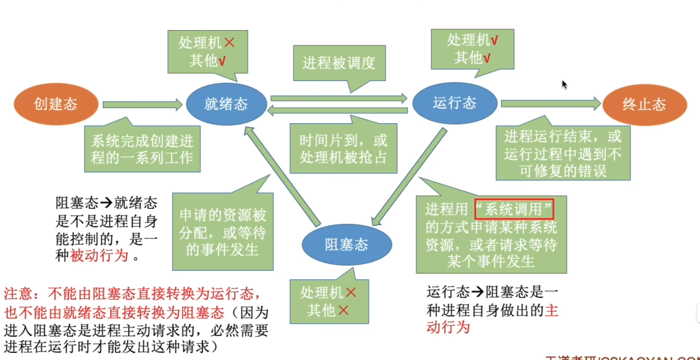
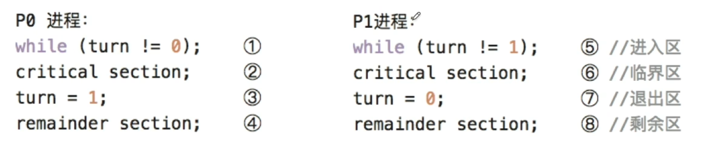
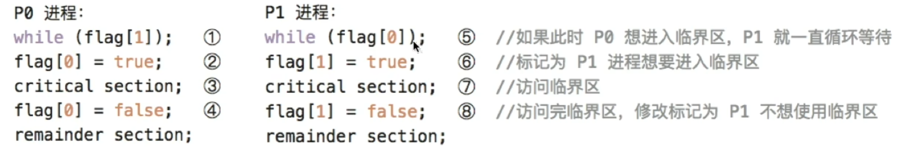
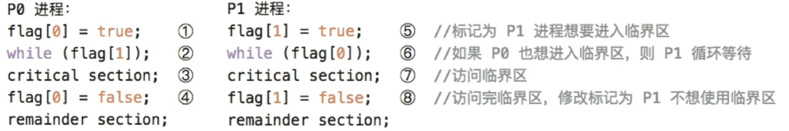
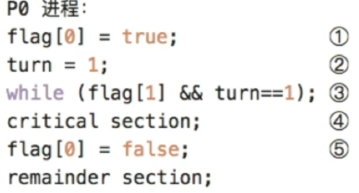
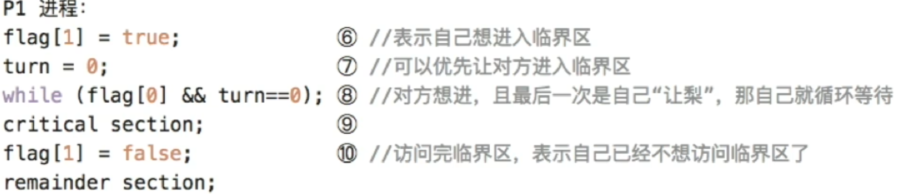
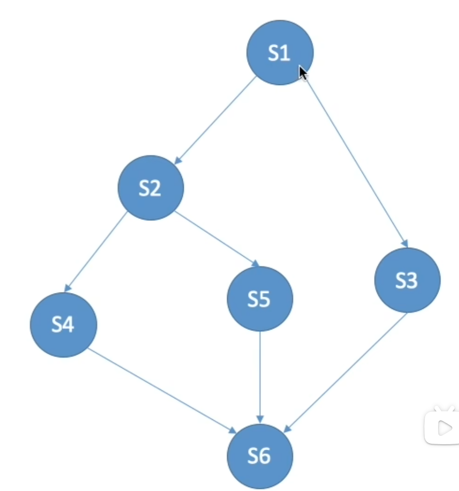

# 进程与线程

## 进程与线程简介

### 进程的概念和特征

#### 进程(Process)的概念
为有效描述和控制程序的并发行为，操作系统引入了**进程**，以支撑操作系统的**并发性**和**共享性**。

**进程控制块PCB**
操作系统通过PCB记录进程的进本信息和运行状态，从而实现对其的控制与管理。
**程序段**、**相关数据段**和**PCB**三者共同构成**进程实体**。

所以，创建进程的**本质**是创建其PCB，撤销进程即释放该PCB及相关资源。

**进程定义**：进程是进程实体的运行过程，**是系统进行资源分配和调度的一个独立单位**。
> 系统资源包括内存空间，IO设备等硬件资源和CPU使用权
> 在存在线程时，线程是CPU调度和分派的基本单位

#### 进程的特性
尽管考试较少直接考察特征，**但是对其内涵的理解是分析进程调度、同步互斥、死锁等问题的基础**
-   **动态性**：进程是程序的一次执行实例，有明确的生命周期，包含多种状态变化，**动态性是进程最根本的特征**
-   **并发性**：多个进程可同时驻存于内存，并在一定时间内交替或并行执行。
    **引入进程的根本目的是为了支持程序的并发执行**
-   **独立性**：进程是能够独立运行、独立获取支援，并作为调度基本单位参与CPU竞争的实体。**任何未建立PCB的程序**，**均不能**被操作系统调度执行。
-   **异步性**：进程相互制约，以不可预知的速度向前推进，这种异步性可能导致结果不可再现，因此**操作系统必须提供相关机制，以协调进程行为，确保执行的正确性**

### 进程的组成
进程是操作系统进行资源分配和调度的基本单位，由三部分组成：程序段、数据段和PCB。

**PCB是最核心的组成部分**

#### PCB
**(Process Control Block)**
创建进程时，操作系统为其分配了一个PCB；该结构常驻内存，可随时被系统访问，并在进程终止时被回收。**PCB是进程存在的唯一标志**，系统<u>唯有</u>通过它才能感知并管理进程。

在进程整个生命期内，**系统始终以依赖PCB对其进行管理**

##### PCB主要包括四类信息
-   **进程标识信息**，用于唯一标识一个进程及其归属关系。
    -   进程ID（PID）是系统为每个进程分配的唯一编号
    -   父进程ID（PPID）记录创建该进程的父进程标识符
    -   用户ID（UID）指明进程所属用户
-   **进程调度信息**，支持操作系统的调度决策与状态管理。
    -   进程当前状态
    -   进程优先级
    -   CPU占用时间
    -   等待时间
    -   进入内存时间
    -   阻塞原因
-   **资源和内存信息**，记录进程所占用的各类系统资源。
    -   代码段指针
    -   数据段指针
    -   堆栈段指针
    -   文件描述符列表
    -   IO资源清单
-   **处理机状态信息**，存储各种寄存器的值。当进程切换出CPU，这些信息必须**完整保存**到PCB中；再次被调度时，系统将其恢复至CPU，使得从中断处继续进行。
    -   通用寄存器值
    -   程序计数器值
    -   程序状态字PSW
    -   栈指针SP

##### 常用PCB组织方式
###### 链接方式
系统将处于相同状态的PCB通过指针链接为一个队列，如就绪队列，阻塞队列。
对于阻塞队进程，还能根据阻塞原因进一步划分。

###### 索引方式
系统为每种状态建立一个索引表，表项指向对应状态PCB

#### 程序段
程序段是进程中可被PCB执行的代码部分。

**程序本身是静态的，可被多个进程共享**。在多个用户同时运行一个程序时，<u>系统只需要在内存中保留一份代码副本，各进程通过各自的PCB执行该共享代码段，从而节省内存空间</u>。

#### 数据段
数据段包含进程所需的各种数据，既包含程序处理的原始输入，也包括执行过程中产生的中间结果和最终输出。

**每个进程的数据段是私有的**

### 进程的内存映像
当程序被加载运行时，操作系统会为其加载一个**虚拟地址空间**，该空间的逻辑布局称为进程的内存映像。它反映进程在运行时代码、数据、堆、栈等部分的组织方式。


典型的进程虚拟地址空间由以下几个主要区域构成

#### 代码段
存放程序的机器指令，**只读**，且允许多进程共享，通常包含以下子区域
-   `.init`：包含程序启动时由系统自动调用的初始化代码
-   `.text`：存放主程序的指令，如main函数
-   `.rodata`：存放只读数据

#### 数据段
存放全局变量和静态变量，分为如下两部分
-   `data`：存放已初始化（已显式赋初值）的全局变量和静态变量，如`int x = 5`
-   `.bss`：存放未初始化的全局变量和静态变量，如`int y`

#### PCB
PCB<u>不属于</u>进程的虚拟地址空间

#### 堆
程序运行时动态申请访问的空间

通过`malloc()`等函数从堆中申请内存，不需要时通过`free()`释放

堆从低地址想高地址增长，大小不固定

#### 栈
支持函数调用，存放局部变量，函数参数，返回地址等临时信息，由系统自动管理。

遵循LIFO原则，**从高地址向低地址拓展**

#### 共享库的存储映射区
**共享库**用于提供进程所依赖的公共函数代码。它们在运行时被动映射到进程的地址空间。**只读**且多进程共享

**代码段和数据段的大小在程序加载时已确定，而堆栈则在运行过程中动态拓展收缩**

### 进程的状态与转换


进程的声明周期中，状态会不断发生转换。
#### 运行态
进程正在CPU上运行，**任何时刻最多只有一个进程处于运行态**

#### 就绪态
进行已获得<u>除CPU</u>所有必要资源，一旦获得CPU，即可投入运行。
可能存在多个就绪进程，组成**就绪队列**

#### 阻塞态
进程因等待某一事件而暂停运行。
可能存在多个阻塞进程，组成**阻塞队列**
> 就绪态只缺少CPU，阻塞态缺少其他

#### 创建态
进程正处于创建过程，尚未进入就绪态，只是一个短暂中间过程，一般不会长期停留。

#### 终止态
进程已完成执行，正在等待系统回收资源，无论正常结束还是强制终止，均变为终止态。

### 进程控制
进程控制的功能是对系统中所有进程进行有效的管理，主要包括创建新的进程。撤销已有进程、实现进程状态转换等操作。通常通过**原语**实现。

**<u>原语</u>在执行期间不允许被中断，是一个不可分割的基本单位**，确保了关键操作的原子性和一致性。
> 如何实现其原子性？通过开关中断指令。

#### 进程的创建 - 创建原语
-  分配唯一标识并申请PCB
-  为新进场分配所需资源
-  初始化PCB
-  插入就绪队列

#### 进程的终止 - 终止原语
-   根据被终止进程的标识符，检索其PCB，并读取当前状态
-   若进程正在运行，立即剥夺CPU，并触发调度程序选择下一个就绪进程
-   释放该进程所占用的所有系统资源，统一还给OS
-   若系统支持级联终止，则递归终止所有子进程；否则子进程继续进行
-   删除PCB

**引起终止的事件**
-   正常结束
-   异常结束，进程在运行时发生了严重错误，无法继续执行
-   外界干预，外部实体请求终止进程

#### 进程的阻塞和唤醒
**Block和Weakup是一对作用相反的原语，必须成对使用**

##### 阻塞原语 Block
-   保存当前进程的CPU现场到其PCB
-   将其PCB的状态字修改为阻塞态，并将该PCB插入等待时间的等待队列中
-   调用调度程序，运行下一个进程

##### 唤醒原语 Weakup
-   在指定时间的等待队列找到目标进程的PCB
-   将其从队列溢出，状态修改为就绪态
-   将该PCB插入就绪队列，等待调度程序适时执行

#### 进程的切换 - 切换原语
-   将运行环境信息存入PCB
-   PCB移入相应队列
-   选择另一个进程执行，并更新器PCB
-   根据PCB恢复新进程所需的运行环境

### 进程的通信
进程通信IPC是进程之间的信息交换
-   **低级通信**：主要用于传递控制信息（如同步互斥），典型代表是PV操作
-   **高级通信**：主要用于高效传输大量数据，主要包括共享存储、消息传递和管道通信

#### 共享存储
用于实现**高效的数据交换**

通过特殊的系统调用，创建一段独立的内存区域，并将其**映射到多个进程的虚拟地址空间**（*也就是让各个进程内有一段空间，都指向该内存区域*），使这些进程都能读写该区域。

因为多个进程可能并发处理同一块内存，**必须由用户程序引入同步互斥机制**

操作系统**仅负责分配共享内存区并完成地址映射，不自动提供同步保护**，具体读写逻辑需要用户程序自行设计完成。

#### 消息传递
在消息传递系统中，进程间数据交换以格式化信息为单位，通过操作系统提供的发送原语和接收原语进行。

这种方式封装在内核中，**对用户透明**。

<u>消息传递是目前应用**最广泛**的进程间通信机制</u>，可分为两种基本模式

-   **直接通信方式**，发送进程通过发送原语发给指定接收进程；内核负责将消息复制到接收方内核缓冲队列；接收进程通过接收原语接收消息。
-   **间接通信方式**，通信双方通过一个**中间实体（信箱）**进行信息交换。

两种方式，消息的投递均通过**邮差（操作系统内核）**完成消息的可靠投递。

#### 管道通信
管道通信是一种基于FIFO原则的进程间通信机制，常用于具有亲缘关系的进程（如父子进程）间，以**生产者*-消费者*模式进行数据交换。

-   从接口上看，**管道**表现为一种特殊的共享文件，支持标准的`read()`和`write()`操作。
-   从实现上看，它是由OS内核维护的一块**固定大小的内存缓冲区**。

管道机制必须提供三方面协调能力
-   **互斥**，任一时刻<u>只允许</u>一个进程对管道进行读写
-   **同步**，当管道满时，写进程自动阻塞，直到读进程取走部分数据；当管道空时，读进程自动堵塞...
-   **写端关闭检测**，当写端关闭后，读端`read`返回 $0$，表面无数据可读。

**管道由父进程创建**，兄弟进程之间的管道也由父进程创建。

#### 信号
信号是一种用于通知进程某个时间已发生的机制。不同系统时间对应不同信号类型，每类信号对应一个序号。*如Linux内核实现了约 $30$ 种信号*。

-   **待处理信号**，PCB中用一个 $n$ 位向量（Linux用 $32$ 位整型）记录。当向某进程发送一个信号时，内核会将该信号位置置 $1$，处理后置 $0$。
-   **被阻塞信号**，也在PCB中用一个 $n$ 位向量表示。阻塞时置 $1$，接触阻塞置 $0$。

**信号发送方式**
-   内核发送信号，内核检测特定系统时间，向相关进程发送相应信号。
-   进程发送信号，进程可以调用`kill()`函数请求内核向指定进程发送信号，也可以向自身发送。

当OS<u>从内核态转为用户态</u>时，会检查当前进程是否存在**未被阻塞的待处理信号**。存在则立即处理其中一个信号（通常优先处理小序号）。

**处理方式**：
-   **执行默认信号处理程序**。OS为没类信号预设了默认操作。
-   **执行进程自定义信号处理程序**，进程可以为某类信号自定义自己的处理函数。
    **当自定义函数存在，则不执行默认程序**，<u>且自定义函数只作用于自身</u>

### 线程和多线程模型
如同引入进程可以让程序并发执行，引入线程可以让一个程序的不同功能并发执行，可进一步**降低程序并发执行的时空开销**

线程是**程序执行流的最小单元**，也是**处理器调度的基本单位**。

多线程OS中，<u>进程不在座位基本的执行试题，但仍保留与执行相关的状态。</u>

**线程主要属性**
-   **轻量级执行实体**：线程本身不具有独立的系统资源，但拥有运行所必须的私有数据结构密保卡**线程ID，程序计数器，寄存器集合**和**栈**。每个线程都具有唯一标识符和一个**TCB**，用于记录其执行上下文
-   **共享代码段**：同一进程的多个线程可并发执行相同的程序代码
-   **资源共享**：同一进程内的所有线程共享该进程的代码段，数据段，堆，文件描述符等**系统资源**
-   **独立调度单位**：线程是CPU调度和执行的基本单位
-   **生命周期**：线程从创建开始，经历就绪，运行，阻塞等状态变化，直至最终终止

#### TCB
OS为每个线程维护一个**TCB线程控制块**，用于记录和管理线程的运行信息，包含
-   线程标识符
-   寄存器集合
-   线程当前状态
-   调度优先级
-   线程局部存储区
-   堆栈指针

同一进程中的所有线程共享该进程的地址空间和全局变量，每个线程拥有**独立的私有栈**

#### 线程的实现方式

##### 用户级线程
指“从用户视角看到的线程”，在该模型，所有线程管理工作均由应用程序在**用户空间（用户态）**完成，无需OS介入。应用程序只需引入线程库，即可被开发为多线程程序

**OS完全感知不到这些线程的存在**

此类线程，**调度仍以进程为单位进行**

**优点**：
-   线程切换在用户态完成，避免模式切换开销
-   调度策略可由应用程序定制
-   用户级线程的实现与OS无关，具有良好的可移植性

**缺点**
-   系统调用的阻塞问题，某个线程的阻塞，会导致该进程所有线程的阻塞
-   无法发挥多处理器的并行优势

##### 内核级线程
内核级线程的管理完全由OS内核负责，所以线程相关的操作均在**内核空间（内核态）**完成。OS为每个内核级线程维护了一个TCB，内核通过改TCB感知现场的存在并对其进行控制

**优点**
-   能发挥多处理器的并行优势
-   阻塞处理更灵活
-   内核自身可采用多线程技术

**缺点**：线程切换需要陷入内核态，系统开销较大


##### 组合方式
内核支持多个内核级线程的创建与调度，同时允许用户程序在用户空间管理多个用户级线程

根据映射关系不同，形成了三种典型的多线程模型
-   多对一模型：多个用户级线程映射到一个内核级线程
-   一对一模型：每个用户级线程映射到一个独立的内核级线程
-   多对多模型：$n$ 个用户级线程映射到 $n$ 个内核级线程($n \ge m$)
    兼具上面两者优点

##### 线程库实现
程序员通过线程库提供的API来创建和管理线程
-   纯用户空间实现，对应用户级线程模型
-   内核支持实现

## CPU调度

### 调度的概念

#### 调度的基本概念
CPU调度是按照一定的算法，从就绪队列中选择一个进程，并将CPU分配给它运行，从而实现多个进程的并发执行。

#### 调度的层次
一个作业从提交到完成，一般经历三级调度

##### 作业调度（高级调度）
负责从外存后备队列按一定规则挑选一个或多个作业，为其分配内存，IO设备等必要资源，并创建相应进程，使其获得参与CPU竞争的资格

作业调度实现内存与外存之间的调度

每个作业在整个生命周期仅调入一次，调出一次

##### 内存调度（中级调度）
内存调度旨在提高内存利用率和系统吞吐量

当系统资源紧张时，会将某些暂时无法处理的进程**换出到外存**，此时进程为<u>挂起态</u>，在进程具备运行条件后，内存调度再将其调入内存，恢复为就绪态。

##### 进程调度（低级调度）
按特定的算法从<u>就绪队列</u>选择一个进程分配CPU。

是**最基础最频繁的一级调度**，在所有OS均存在，且调度频率很高。

#### 三级调度的联系
**进程调度最基本且不可或缺**，作业调度和内存调度根据系统类型和设计目标选择性配置

### 进程调度

#### 进程调度的任务
-   **保存CPU现场**，调度发生时，需要将当前进程的CPU状态完整保存至其PCB
-   **选取待运行进程**，调度程序依据特定算法，从就绪队列选取一个进程改为运行态
-   **完成CPU分配**，分派程序加载PCB，移交CPU

#### 调度程序（调度器）
用于实现CPU<u>调度与分派</u>的**软件组件**为调度程序，通常由三部分组成：
-   **排队器**，将系统中所有就绪进程按策略组织为一个或多个就绪队列。每当有进程转为就绪态，排队器便将其插入相应队列。
-   **分派器**，负责执行时机的CPU分配操作，主要任务包括：从就绪队列移出目标进程，触发上下文切换，将CPU控制权转交。
-   **上下文切换器**，对CPU切换时，会发生<u>两对</u>上下文切换
    -   第一对，当前进程上下文保存到其PCB，再装入分派程序上下文
    -   第二对，溢出分派程序上下文，将新选进程装入
    > 但是宏观上 $n$ 次切换只有 $n$ 

    上下文切换需要执行大量·`load`和`store`指令以保存寄存器，内容<u>开销较大</u>。目前有<u>硬件实现</u>的方法减少切换时间。
    通常由两组寄存器，一组供内核使用，另一组供用户。这样上下文切换只需要改变指针。

#### 调度的时机，切换与过程
调度程序是OS内核程序。只有当请求调度的事件发生后，才会运行调度程序；调度出新的就绪进程后，才会进行进程切换。

理论上三个步骤应该按顺序，但是实际在发生引发调度的条件后，也不一定能立即进行调度与切换。

**进程CPU调度的一般时机**
-   创建新进程后
    父子进程都处于就绪态，需要决定运行哪一个
-   进程结束或终止后
-   进程被阻塞时
-   IO设备准备就绪后
-   对于抢占系统，更高优先级进程进入
-   当前进程时间片用完

**进程切换的过程**
进程切换通常紧随调度之后发生。

OS内核会将原进程的上下文保存到其PCB或内核中；随后从新进程的PCB或内存栈加载器到上下文，更新地址空间相关信息，重置计数器，并开始执行新进程。

**不能进行进程调度和切换的情况**
处理终端和执行原子操作的过程中

#### 进程调度的方式
进程调度方式指：当某个进程正在CPU上执行时，若有优先级更高的进程进入就绪队列，此时系统应如何分配CPU。

一般有如下两种方式：
##### 非抢占调度方式
也称非剥夺式。

当进程正在CPU执行，更高优先级进程进入就绪队列，仍然会让当前进行继续执行，直到其离开运行态（完成或阻塞）。
> 为什么不包括时间片用完切换到就绪态
> 因为时间片是抢占式OS的内容
##### 抢占式调度
也称剥夺方式

当进程正在CPU执行，出现更高优先级进程后，调度程序依据一定策略暂停当前进程，将CPU分配给更紧迫的进程。

#### 闲逛进程
当进程切换发生时，若系统中没有就绪进程，就会调度闲逛进程。

**闲逛进程的优先级最低，PID为 $0$**

其主要任务是在空闲循环中不断检测中断检测。

#### 两种线程的调度
**用户级线程调度**
因为内核不知道线程的存在，内核仍以进程为单位进程调度。

进程获得CPU后，由用户级线程库决定运行哪个线程。

**内核级现场调度**
内核直接感知并管理每个线程，调度选择特定<u>线程</u>。
<u>每个线程拥有独立的内核上下文，可被单独赋予时间片，也可以被更高优先级线程抢占</u>。

### 调度的目标（衡量标准）
**不存在一种调度算法同时满足所有用户需求和系统目标**。

设计调度程序时，需要坚固应用场景的要求，整体效率和调度算法自身的开销。

#### CPU利用率
$CPU利用率 = \dfrac{CPU有限工作时间}{CPU有效工作时间+CPU空闲等待时间}$ 

#### 系统吞吐量
表示单位时间内系统完成的作业数量

不同调度算法队吞吐量有显著影响

#### 周转时间
从作业提交到作业完成的总时间，包括<u>作业等待</u>、**在就绪队列排队**，在CPU执行以及IO操作等各阶段的时间之和。

$周转时间 = 作业完成时间 - 作业提交时间$

$平均周转时间 = \dfrac{作业1周转时间+\cdots+作业 n 周转时间}{n}$

**带权周转时间**用于衡量作业的相对等待程度

$带权周转时间 = \dfrac{作业周转时间}{作业实际运行时间}$

$平均带权周转时间 = \dfrac{作业1带权周转时间+\cdots+作业n带权周转时间}{n}$

#### 等待时间
进程在**就绪队列**的等待时间

等待时间越长，响应延迟越高，满意度越低。

$等待时间 = 周转时间 - 运行时间 - IO操作时间$


#### 响应时间
从用户提交请求到系统首次产生响应所经历的时间。

#### 响应比
$响应比 = \dfrac{等待时间+估计运行时间}{估计运行时间}$

### 进程切换
进程切换是在内核的支持下完成的，或者说<u>任何进程都是在OS内核的支持下运行的</u>

#### 上下文切换
将CPU切换到另一个进程，需要保存当前进程的状态，并且恢复另一个进程的状态，这是上下文切换。

**进程上下文由其PCB表示**，包括CPU寄存器值，进程状态，内存管理讯息等。

**流程如下**
-   挂起当前进程，将其CPU上下文保存到其PCB中
-   将改进INC的PCB移入相应的队列
-   选择另一个进程执行，并更新其PCB中的相关信息
-   恢复新进程的CPU上下文
-   跳转到新进程PCB中的程序计数器所指向的位置，开始执行该进程

#### 上下文切换的开销
**上下文切换是一项开销较大的操作**，为了减少这一开销，某些处理器架构提供多个寄存器组，通过切换寄存器组指针即可完成上下文切换。但大多通用处理器仍然需要完整操作寄存器。

#### 上下文切换与模式切换
模式切换（用户态与内核态切换）与上下文切换是两个不同的概念

模式切换过程中**当前进程未改变**

上下文切换**只能由内核完成**，且整个切换过程运行在内核态

### CPU调度算法
不同的调度算法适用于不同的常见或调度

#### 先来先服务（FCFS）调度算法
最简单的调度算法吗，可用于作业调度和进程调度。

**过程**
-   **作业调度**
    每次从后备作业队列选择**最早进入该队列**的一个或多个作业调入内存。
-   **进程调度**
    每次从就绪队列选择最早进入该队列的进程分配CPU

FCFS属于**非抢占式算法**。
长作业先到达会增加后续短作业的等待时间，因此不适合作为分时系统和实时系统的主要调度策略。

**特点**
实现简单，但效率低，对长作业有利。不会导致饥饿。

#### 短作业优先（SJF）调度算法
一种按照作业或进程预计运行时间进行调度的策略。

**过程**
-   **作业调度**
    从后备队列中选择**估计运行时间最短**的一个或多个作业调入内存
-   **进程调度**
    称为短进程优先SPF，从就绪队列中选择**估计运行时间最短**的进程分配CPU

**缺点**，对长作业不利，未考虑作业紧迫度，作业长短由用户估计值决定

**抢占式版本**，最短剩余时间优先算法（SRTN），当一个新进程到达就绪队列，且其估计运行时间比当前进程<u>剩余运行时间</u>更短，则进程切换。

**在所有进程同时可运行或几乎同时到达时**，SJF调度算法的平均等待时间，平均周转时间最少。
<!-- 在无此限定条件下，最短剩余时间优先算法性质更优 -->

**可能产生饥饿**
尤其在始终有新的短作业到达的情况下，长作业会产生饥饿。

#### 高响应比优先调度算法
主要用于作业调度。

在调度决策时同时考虑作业的等待时间和估计运行时间

$响应比 = \dfrac{等待时间+估计运行时间}{估计运行时间}$
响应比高的会优先调度

**特性**
-   等待时间相同，估计运行时间越低，响应比越大
-   估计运行时间相同，等待时间越大，响应比越大
-   长作业随着等待时间提高，有限时间内必然会被调度，避免了饥饿

#### 优先级调度算法
优先级调度算法通过为每个作业或进程分配一个优先级，以反映其紧迫程度

**过程**
从后备队列/就绪队列选择优先级最高的进程调度

**是否抢占**
-   **非抢占式**优先级调度算法
    即使有更高优先级，也继续运行
-   **抢占式**优先级调度算法
    有更高优先级，则立刻进程切换。

##### 优先级
**分类**
-   **静态优先级**
    优先级在创建时缺点，整个运行期间保持不变，可能出现低优先级饥饿
-   **动态优先级**
    创建时赋予初始优先级，在运行时根据进程推荐和等待时间动态调整。

**优先级设置规则**
-   系统进程 $>$ 用户进程
-   交互型进程 $>$ 非交互型进程
-   IO型进程 $>$ 计算型进程
    因为IO操作较少且IO速度低于CPU，所以高优先级可以使之尽快启动IO设备

#### 时间片轮转（RR）调度算法
主要适用于分时系统，**最大特点是公平性**，属于**抢占式**算法

系统将所有就绪进程按FCFS组织为就绪队列，每隔固定的时间间隔（时间片）就产生一次时钟中断，激活调度程序，将CPU分配给就绪队列的队首，使其运行一个时间片。当该进程执行完该时间片后，剥夺其CPU，并重新放入队尾。

**调度时机**
当前进程运行完成，或者时间片用尽

**时间片大小**
时间片大小队系统性能有显著影响
-   时间片过大，几乎所有进程都能在一个片内完成，则退化为FCFS
-   时间片过小，需要频繁进行进程调度和上下文切换，大幅增加开销

一个较为合理的时间片，应略长与一次典型交互所需时间，这样可以保证大多数交互式进程在单个片内完成，又能控制上下文切换频率。
> 典型交互如用户在文件编辑器输入一个字符，或者在终端按下回车

#### 多级队列调度算法
将就绪队列划分为多个独立就绪队列，每个队列对应一类有相似特性的进程。

每个队列可**独立采用合适的调度算法**，且**各个队列有不同的优先级**，只有高优先级队列为空，才会调度低优先级队列。

#### 多级反馈队列调度算法
是时间片轮转调度算法与优先级调度算法的综合

通过**动态调整进程所处队列（优先级）和对应的时间片大小**，该算法能兼顾系统的多种目标：
-   有利于短进程
-   提高吞吐量并缩短平均周转时间
-   利于IO进程以提升设备利用率和响应速度
-   **无需实现知道进程运行时间**

**实现机制**
-   设置多个就绪队列。每个队列赋予不同优先级，$1$ 级最高，$n$ 级最低。
    为各级队列分配不同的时间片，优先级越高，时间片越小
    > $i+1$ 级时间片一般是 $i$ 级的两倍
-   每个队列内部按时间片轮转调度。新进程创建后，首先放入 $1$ 级队列末位。轮到该进程执行，若时间片用完仍未完成，则进入下一级队列队尾。在 $n$ 级队列仍未完成，则仅需进入 $n$ 级队列。
-   按队列优先级调度。调度程序总是有限调度最高优先级队列的队首，
    当 $1 \sim i-1$ 级队列空，才会调度 $i$ 级

#### 基于公平原则的调度算法
上述算法均未将调度公平性作为主要设计目标，下述两者为以公平性为核心的调度算法
##### 保证调度算法
为每个进程提供**可量化的CPU时间分配保证**
比如 $n$ 个进程的系统，乜咯进程应获得 $1/n$ 的CPU时间

##### 公平分享调度算法
给各个用户分配相同的CPU时间，或者按要求比例分配。

### 多处理机调度
多处理机系统的进程调度比单处理机系统要更为复杂，调度策略与系统结构有关。

**处理机系统分类**
-   **非对称多处理机**，通常采用主从结构：一个主CPU负责全部调度决策和系统管理，其余从CPU仅执行任务而不参与调度。
-   **对称多处理机SMP**，所以CPU地位对等，下述内容均讨论SMP调度问题

#### 亲和性和负载平衡
**处理机亲和性**，让进程尽可能在同一个CPU运行，以**发挥CPU中Cache**的作用
各个CPU有其Cache，切换CPU时需要将前一个CPU的缓存清楚，再加入第二个CPU，操作代价较高。

**负载均衡**，让多个CPU负载尽量接近

**通常负载平衡会抵消处理机亲和带来的好处**

#### 处理机调度方案
##### 公共就绪队列
所有CPU共享一个公共就绪队列。这样可以很好的视线负载平衡，但是亲和性不好。

**提高亲和性的方法**
-   **软亲和**，调度程序尽量让一个进程保持在某个CPU上运行，但是该进程仍可迁移
-   **硬亲和**，用户进程通过系统调用，**主动请求将其绑定在固定的CPU上**

##### 私有就绪队列
每个CPU设置一个私有就绪队列，每个CPU仅调度自己的就绪队列进程。这样保住了亲和性，但是负载均衡不好。

**平衡负载的方法**
-   **推迁移**，一个指定系统程序周期性的检查各个CPU的负载，若发现不均衡，则从超载CPU中推出部分进程到空闲CPU。
-   **拉迁移**，当某个CPU负载很低时，主动从超载CPU就绪队列拉取部分进程

**实际系统通常结合使用**
**也可以通过硬亲和，要求某个进程始终在一个就绪队列**

## 同步与互斥

### 同步和互斥的基本概念
在多道程序环境下，进程并发执行，不同进程存在多种相互制约关系。为了协调，引入了**进程同步**的概念

#### 临界资源
许多资源在**同一时刻仅允许一个进程访问**，这类资源被称为**临界资源**。

临界资源必须**互斥访问**，每个进程访问临界资源的代码称为**临界代码**，划分为四个部分
-   **进入区**，进入临界区前，进程需要检查当前是否允许进入。若允许，则设置“正在访问临界区”标志，以阻止其他进程同时进入。
-   **临界区**，进程中世纪访问临界资源的代码，也叫<u>临界段</u>
-   **退出区**，离开临界区时，清楚访问标识。
-   **剩余区**，除上述三部分之外内容

```cpp
while(true)
{
    entry section;      //进入区
    critical section;   //临界区
    exit section;       //退出区
    remainder section;  //剩余区
}
```

#### 同步（直接制约关系）
同步是指位完成某种任务而建立的两个或或多个进程，由于需要协调彼此的运行次序，而在执行过程中产生等待或穿戴信息的制约关系。

同步关系源于进程间的**相互合作**。

#### 互斥（间接制约关系）
互斥指当一个进程正在临界区中使用临界资源时，其他试图访问该资源的进程必须等待。

#### 同步机制应遵循以下准则
为防止多个进程同时进入临界区，应遵循：
-   **空闲让进**，临界区空闲，应运行一个请求进入的进程立即进入
-   **忙则等待**，已有进程在临界区，则其他请求进程必须等待，以保证<u>对临界资源的互斥访问</u>
-   **有限等待**，对任何请求进程，应保证期在有限时间进入临界区
-   **让权等待**，当进程因无法进入临界区而需要等待是，应该主动放弃CPU使用权，进入阻塞态
    > 原则上应该遵循，但非必须

    对于这一节所有无法实现让权等待的算法，若是前三无法实现忽略。我都有个问题，为什么都不引入阻塞。查找发现，对于多核，在等待途中很可能得到临界区资源，开销可能比上下文切换要小。而单核就很需要引入阻塞的。
    或者也可能是阻塞的出现较晚，只是学习的较早。
    > 查找发现的确如此

### 实现临界区互斥的基本方法

#### **软件实现方法**
在进入区设置并检查一些标志，用以表面师范有进程正在临界区中。若已有进程在临界区，则期进程在进入去通过循环检查方式等待；进程离开临界区后，在退出区修改相应标志

##### 单标志法
设置一个公用变量`turn`，用于指示当前允许进入临界区的进程编号。

每当一个进程退出临界区，就将`turn`设置为另一个进程


**缺点**
两个进程**必须**交替进入临界区，若某一个不再请求进入，则另一个再也无法进入，<u>违背**空闲让进**准则</u>

##### 双标志先检查法
设置一个bool类型数组`flag[2]`，用来标记各进程是否希望进入临界区。

一个进程进入临界区前，先检查对方是否想进入；若对方想，则等待；否则将自己的`flag[i]`置1，然后进入临界区。当其推出时，将`flag`置0


**优点** 无需交替使用，进程可以连续使用临界区
**缺点** 某些顺序，如1526，进程可能都先检查对方标识，再设置自己标识，然后都进入临界区。<u>违背**忙则等待**准则</u>；同时，进程肯长期甚至永远无法获得控制器，<u>违背**有限等待**准则</u>，导致饥饿

##### 双标志位后检查法
先设置自己标志，再检查对方标志


若顺序为1234，两个进程都先设置了格子标志，然后检查对方，发现对方想要进入，然后彼此等待。<u>违背**空闲让进**准则</u>。且进程可能长期等待，<u>违背**有限等待**准则</u>，可能导致饥饿

##### Peterson算法
结合13思想，`flag[]`解决互斥问题，`turn`解决饥饿问题

若`flag[i] = true`，则表示 $P_i$ 想要进入临界区
若 `turn = i`，则表示<u>如果两者**都想**进入，则让 $P_i$ 进入</u>

**具体操作**
在 $i$ 进入临界区前，先将自己的`flag[i]`设为1，并将`trun`设为 $j$（主动谦让）。随后检查`flag[j] && turn == j`，即对方想进入且运行其优先，若为真则等待，否则 $i$ 进入临界区

|
-|-


<u>仅没有遵循**让权等待**准则</u>

#### 硬件实现方法
现代计算机提供了特殊硬件指令，能以原子方式对一个字进行检测和修改，或是交换两个字的内容。因此，可以利用他们实现临界区的互斥访问。

##### 中断屏蔽方法
**关中断**是实现互斥最简单的方法之一。

在执行临界区代码之前关闭中断，完成后重新打开即可。

**缺点**
-   限制CPU并非能力
-   将关中断权限开放给用户，风险很高
-   **不适用于多处理器系统**，在某一CPU关中断无法阻止其他CPU并发访问同一临界区


##### 硬件指令方法 —— TestAndSet指令
TS指令，也叫TestAndSetLock - TSL指令。

该指令是原子操作，功能是：读取知道标志的当前值，并立即将其置为 $1$，然后返回读取到的旧值。
```cpp
bool TestAndSet(bool *lock)// 只是类伪代码
{
    bool old;
    old = *lock;
    *lock = true;
    return old;
}
```

若返回值为 `false`，则当前未占用，可以进入临界区；否则等待。
因为TS指令会自动上锁，所以进程只需要结束时解锁。

##### 硬件指令方法 —— Swap指令
Swap指令**原子的**交换两个变量的值
典型实现如下
```cpp
bool key = true;
while(key != false)
    swap(&lock, &key);
// 临界区代码
lock = false;
// 其他代码
```

### 互斥锁
解决临界区最简单的工具是互斥锁。一个进程在进入临界区前调用`acquire()`获得锁；退出时调用`release()`释放锁。

每个互斥锁包含一个`available`变量，用于表示锁是否可用。

```cpp
acquire()// 获得锁的定义
{
    while(!acailable);// 忙等待
    available = false;// 获得锁
}
release()// 释放锁的定义
{
    available = true;// 释放锁
}
```

`acquire()`和`release()`必须是原子操作，所以互斥锁通常采用硬件机制实现。

上述锁也称为**自旋锁**，缺点是<u>忙等待</u>，类似的还有单标志法，TS指令，Swap指令。适用于多处理器系统。

### 信号量
信号量机制是一种功能强大的同步机制，能解决互斥问题和进程间同步问题。

它今年通过两个**标准原语**访问：`wait()`和`signal()`，也叫 $P$ 操作 和 $V$ 操作。

#### 整型信号量
用一个<u>整型变量 $S$</u> 表示某类资源的可用数量。

仅限三种操作对其使用：初始化、P操作，V操作
```cpp
P(S)// wait()
{
    while(S <= 0);// 循环等待
    S --;
}

V(S)// signal()
{
    S ++;
}
```

当 $S \le 0$ 时，会忙等待。<u>未遵循让权等待</u>

#### **记录型信号量**
通过阻塞机制**实现了让权等待**

记录型信号量采用结构化数据表示
```cpp
struct
{
    int value;;         // 当前可用资源数
    struct process *L;  // 等待队列，用于链接阻塞进程
}semaphore;
```

响应的PV操作
```cpp
void P(semaphore S)
{
    S.value --;
    if(S.value < 0)
    {
        add this process to S.L;// 将当前进程加入等待队列
        block(S.L);             // 自我阻塞
    }
}

void V(semaphore S)
{
    S.value ++;
    if(S .value <= 0)
    {
        remove a process P form S.L // 从等待队列S.L取出一个进程P
        wakeup(P);                  // 唤醒
    }
}
```
`block()`和`wakeup()`出自第一节阻塞和唤醒原语
> 为什么V操作是 S.value <= 0？
> 进入signal则代表释放了一项资源，而value $< 0$ 代表等待队列有进程，自然需要取出
> **不代表临界资源数 $< 0$**

#### 利用信号量实现互斥
为使多个进程互斥访问临界资源，为该资源设置一个**互斥信号量S**，初始设为 $1$。
> 为什么不设置为可用数量？
    因为需要的是互斥的访问临界区，也就是同时只允许一个进程访问。

具体如代码
```cpp
semaphore S = 1;
P1()
{
    // ...
    P(S);   // 申请临界资源，加锁
    临界区
    V(S);   // 释放临界资源，解锁
    // ...
}

P2()
{
    // ...
    P(S);
    临界区
    V(S);
    // ...
}
```

#### 利用信号量实现同步
若某一进程的操作依赖另一进程的执行结果，则必须保证前者在后者之后执行。

为此，引入一个**同步信号量 $S$**，初值设为 $0$
```cpp
semaphore S = 0;    // 初始化信号量
P1()
{
    // ...
    x;              // 执行语句x
    V(S);           // 通知P2，x已完成
    // ...
}

P2()
{
    // ...
    P(S);           // 等待x完成
    y;              // 使用x的结果执行y
    // ...
}
```

在 $P_1$ 执行后，$P_2$ 才能通过P操作，顺利执行y；若是先执行 $P_2$，P操作会调用`block()`阻塞 $P_2$


#### PV操作实现同步互斥的总结
**同步**，提供资源的行为之后，应该V该资源；需要改资源的操作之前，应该P该资源
**互斥**，临界区应该被降紧夹在PV操作中

#### 利用信号量实现前驱关系
每对前驱关系都对应一个同步问题，后继段必须等待前驱段完成。
**示例**


```cpp
semaphore a12 = 0, a13 = 0, a24 = 0, a25 = 0, a36 = 0, a46 = 0, a56 = 0;
S1()
{
    // ...
    V(a12), V(a13);
}
S2()
{
    P(a12);
    // ...
    V(a24), V(a25);
}
S3()
{
    P(a13);
    // ...
    V(a36);
}
S4()
{
    P(a24);
    // ...
    V(a46);
}
S5()
{
    P(a25);
    // ...
    V(a56);
}
S6()
{
    P(a36);
    P(a46);
    P(a56);
    // ...
}
```

### 经典同步问题
#### 生产者 - 消费者问题
```cpp
semaphore mutex = 1;
semaphore empty = 1;
semaphore full = 1;
producer()
{
    while(1)
    {
        // 生产产品
        P(empty);
        P(mutex);
        // 放入缓冲区
        V(mutex);
        V(full);
    }
}
consumer()
{
    while(1)
    {
        P(full);
        P(mutex);
        // 取出产品
        V(mutex);
        V(empty);
        // 消费产品
    }
}
```
**必须先判断是否能操作，在锁住**


#### 多生产者 - 消费者问题
问题描述
桌上有一个盘子，最多容纳一个水果。
-   爸爸向盘中放入苹果
-   妈妈向盘中放入橘子
-   女儿只吃苹果
-   儿子只吃橘子

当盘子空，爸爸妈妈才能放入一个水果；盘子有自己需要的，儿子女儿才能取出使用

**因为盘子只有一个位置**，所以自带互斥的性质（至多只能有一个进程访问盘子）。若是盘子容量 $>1$，则进程应该互斥。否则可能互相覆盖。
> 王道说是互相覆盖，但感觉更可能是总量超出容量，不过也得看实际情况

```cpp
// 盘子容量为1情况
semphore plate = 1, apple = 1, orange = 0;
dad()
{
    while(1)
    {
        准备一个苹果;
        P(plate);
        苹果放入盘子;
        V(apple);
    }
}
mom()
{
    while(1)
    {
        准备一个橘子;
        P(orange);
        橘子放入盘子;
        V(orange);
    }
}
son()
{
    while(1)
    {
        P(orange);
        从盘子中取出橘子;
        V(plate);
        吃掉橘子;
    }
}
daughter()
{
    while(1)
    {
        P(apple);
        从盘子中取出苹果;
        V(plate);
        吃掉苹果;
    }
}

// 盘子容量为2
semphore plate = 1, apple = 1, orange = 0;
semphore mutex = 1;
dad()
{
    while(1)
    {
        准备一个苹果;
        P(plate);
        P(mutex);
        苹果放入盘子;
        V(mutex);
        V(apple);
    }
}
mom()
{
    while(1)
    {
        准备一个橘子;
        P(orange);
        P(mutex);
        橘子放入盘子;
        V(mutex);
        V(orange);
    }
}
son()
{
    while(1)
    {
        P(orange);
        P(mutex);
        从盘子中取出橘子;
        V(mutex);
        V(plate);
        吃掉橘子;
    }
}
daughter()
{
    while(1)
    {
        P(apple);
        P(mutex);
        从盘子中取出苹果;
        V(mutex);
        V(plate);
        吃掉苹果;
    }
}
```

#### 读者-写者问题
读者写者共享一个文件，多个读者可以同时读取文件，但是任一写者和其他进程互斥。

**读者优先**
若是读者源源不断，可能写者饥饿
```cpp
int count = 0;      // 记录读者数量
seamphore mutex = 1, rw = 1;

writer()
{
    while(1)
    {
        P(rw);
        wirte;
        V(rw);
    }
}

reader()
{
    while(1)
    {
        P(mutex);   // 互斥访问count
        if(count == 0)
            P(rw);  // 上锁写者
        count ++;
        V(mutex);
        read;
        P(mutex);   // 互斥访问count
        count --;
        if(count == 0)
            V(rw);
        V(mutex);
    }
}
```

**写者优先**
```cpp
int count = 0;      // 记录读者数量
seamphore mutex = 1, rw = 1;
seamphore w = 1;
writer()
{
    while(1)
    {
        P(w);   // 上锁读者
        P(rw);
        wirte;
        V(rw);
        V(w);   // 解锁
    }
}

reader()
{
    while(1)
    {
        P(w);
        P(mutex);   // 互斥访问count
        if(count == 0)
            P(rw);  // 上锁写者
        count ++;
        V(mutex);
        read;
        P(mutex);   // 互斥访问count
        count --;
        if(count == 0)
            V(rw);
        V(mutex);
    }
}
```

#### 哲学家进餐问题
$n$ 位哲学家在一个圆桌，两人直接有一双筷子，每个人只有拿着两边的筷子才能吃饭。

### 管程
类似于类的概念，但是貌似重点在基础概念而非伪代码

管程利用一个**共享数据结构**来表示系统中的的共享资源，并将对该数据结构的所有操作封装为一组过程（类似函数）。进程对共享资源的申请、释放等操作，都必须通过调用这些过程完成。

## 死锁
### 死锁的概念
#### 死锁的定义
**死锁**是指多个进程因竞争资源而陷入相互等待的僵局：每个进程都在等待其他进程所占有的资源，而这些资源又不会被释放，从而形成了一个循环等待链。

#### 死锁与饥饿
**饥饿**是指<u>某个进程</u>因资源分配策略的不公平，长期得不到所需资源，从而无法推行其执行。

**死锁不等于饥饿**，饥饿只针对单个或个别进程，系统和其他进程仍然可以正常运行。

**共同点**：相关进程都无法顺利向前推进

**区别**
-   **设计进程数量不同**，饥饿可以只影响单个进程，而死锁必须设计两个或以上，且存在<u>循环等待关系</u>
-   **进程所属状态不同**，饥饿可能处于就绪态或阻塞态；死锁必定处于阻塞态。

#### 死锁产生的原因
-   系统资源的竞争
-   进程推进顺序非法
-   同步机制使用不当

#### 死锁产生的必要条件
**必须同时满足以下四个条件**
-   互斥条件，所需资源需要被互斥访问
-   不可剥夺条件，进程已获得的资源不可被强行剥夺
-   请求并保持条件，进程被阻塞时，不释放已占用资源
-   循环等待条件，产生循环等待链
    **资源分配图存在环，但不必然存在死锁**

**条件23辨析：**
不可剥夺条件，指不能被其他人不能强行取走
请求并保持条件，指当前不主动放弃

#### 死锁处理策略
-   预防死锁。破坏死锁产生的四个必要条件的部分
-   避免死锁。用某种方法防止系统进入不安全状态。
-   死锁的检测和接触。允许死锁发生，但是OS会检测死锁的发生，并采取策略解除。

### 死锁预防
预防死锁