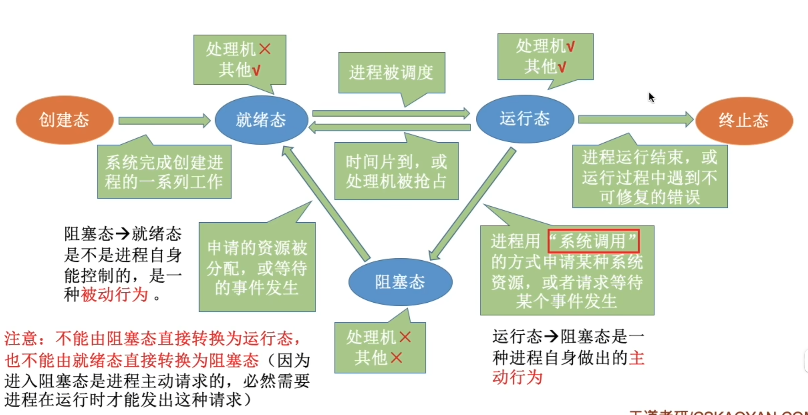

# 进程与线程简介
## 进程的概念和特征
### 进程(Process)的概念
为有效描述和控制程序的并发行为，操作系统引入了**进程**，以支撑操作系统的**并发性**和**共享性**。

**进程控制块PCB(Process Control Block)**
操作系统通过PCB记录进程的进本信息和运行状态，从而实现对其的控制与管理。
**程序段**、**相关数据段**和**PCB**三者共同构成**进程实体**。

所以，创建进程的**本质**是创建其PCB，撤销进程即释放该PCB及相关资源。

**进程定义**：进程是进程实体的运行过程，**是系统进行资源分配和调度的一个独立单位**。
> 系统资源包括内存空间，IO设备等硬件资源和CPU使用权

### 进程的特性
尽管考试较少直接考察特征，**但是对其内涵的理解是分析进程调度、同步互斥、死锁等问题的基础**
-   **动态性**：进程是程序的一次执行实例，有明确的生命周期，包含多种状态变化，**动态性是进程最根本的特征**
-   **并发性**：多个进程可同时驻存于内存，并在一定时间内交替或并行执行。
    **引入进程的根本目的是为了支持程序的并发执行**
-   **独立性**：进程是能够独立运行、独立获取支援，并作为调度基本单位参与CPU竞争的实体。**任何未建立PCB的程序**，**均不能**被操作系统调度执行。
-   **异步性**：进程相互制约，以不可预知的速度向前推进，这种异步性可能导致结果不可再现，因此**操作系统必须提供相关机制，以协调进程行为，确保执行的正确性**

## 进程的组成
进程是操作系统进行资源分配和调度的基本单位，由三部分组成：程序段、数据段和PCB。**PCB是最核心的组成部分**

### PCB
创建进程时，操作系统为其分配了一个PCB；该结构常驻内存，可随时被系统访问，并在进程终止时被回收。**PCB是进程存在的唯一标志**，系统<u>唯有</u>通过它才能感知并管理进程。

在进程整个生命期内，**系统始终以依赖PCB对其进行管理**

#### PCB主要包括四类信息
-   **进程标识信息**，用于唯一标识一个进程及其归属关系。
    -   进程ID（PID）是系统为每个进程分配的唯一编号
    -   父进程ID（PPID）记录创建该进程的父进程标识符
    -   用户ID（UID）指明进程所属用户
-   **进程调度信息**，支持操作系统的调度决策与状态管理。
    -   进程当前状态
    -   进程优先级
    -   CPU占用时间
    -   等待时间
    -   进入内存时间
    -   阻塞原因
-   **资源和内存信息**，记录进程所占用的各类系统资源。
    -   代码段指针
    -   数据段指针
    -   堆栈段指针
    -   文件描述符列表
    -   IO资源清单
-   **处理机状态信息**，存储各种寄存器的值。当进程切换出CPU，这些信息必须**完整保存**到PCB中；再次被调度时，系统将其恢复至CPU，使得从中断处继续进行。
    -   通用寄存器值
    -   程序计数器值
    -   程序状态字PSW
    -   栈指针SP

#### 常用PCB组织方式
**链接方式**：
系统将处于相同状态的PCB通过指针链接为一个队列，如就绪队列，阻塞队列。
对于阻塞队进程，还能根据阻塞原因进一步划分。

**索引方式**
系统为每种状态建立一个索引表，表项指向对应状态PCB

### 程序段
程序段是进程中可被PCB执行的代码部分。

**程序本身是静态的，可被多个进程共享**。在多个用户同时运行一个程序时，<u>系统只需要在内存中保留一份代码副本，各进程通过各自的PCB执行该共享代码段，从而节省内存空间</u>。

### 数据段
数据段包含进程所需的各种数据，既包含程序处理的原始输入，也包括执行过程中产生的中间结果和最终输出。

**每个进程的数据段是私有的**

## 进程的内存映像
当程序被加载运行时，操作系统会为其加载一个**虚拟地址空间**，该空间的逻辑布局称为进程的内存映像。它反映进程在运行时代码、数据、堆、栈等部分的组织方式。

典型的进程虚拟地址空间由以下几个主要区域构成
-   **代码段**，存放程序的机器指令，**只读**，且允许多进程共享
-   **数据段**，存放全局变量和静态变量
-   **PCB**，PCB<u>不属于</u>进程的虚拟地址空间
-   **堆**，程序运行时动态申请访问的空间
-   **栈**，支持函数调用，存放局部变量，函数参数，返回地址等临时信息，由系统自动管理。
    遵循高地址向低地址拓展
-   **共享库的存储映射区**，**共享库**用于提供进程所依赖的公共函数代码。它们在运行时被动映射到进程的地址空间。**只读**且多进程共享

**代码段和数据段的大小在程序加载时已确定，而堆栈则在运行过程中动态拓展收缩**

## 进程的状态与转换

进程的声明周期中，状态会不断发生转换。
-   **运行态**，进程正在CPU上运行。
    **任何时刻最多只有一个进程处于运行态**
-   **就绪态**，进行已获得<u>除CPU</u>所有必要资源，一旦获得CPU，即可投入运行。
    可能存在多个就绪进程，组成<u>就绪队列</u>
-   **阻塞态**，进程因等待某一事件而暂停运行。
    可能存在多个阻塞进程，组成<u>阻塞队列</u>
    > 就绪态只缺少CPU，阻塞态缺少其他
-   **创建态**，进程正处于创建过程，尚未进入就绪态。
    只是一个短暂中间过程，一般不会长期停留。
-   **终止态**，进程已完成执行，正在等待系统回收资源
    无论正常结束还是强制终止，均变为终止态。

## 进程控制
进程控制的功能是对系统中所有进程进行有效的管理，主要包括创建新的进程。撤销已有进程、实现进程状态转换等操作。通常通过**原语**实现。

**<u>原语</u>在执行期间不允许被中断，是一个不可分割的基本单位**，确保了关键操作的原子性和一致性。
> 如何实现其原子性？通过开关中断指令。

### 进程的创建
**创建原语**
-  分配唯一标识并申请PCB
-  为新进场分配所需资源
-  初始化PCB
-  插入就绪队列

### 进程的终止
**撤消原语**
-   根据被终止进程的标识符，检索其PCB，并读取当前状态
-   若进程正在运行，立即剥夺CPU，并触发调度程序选择下一个就绪进程
-   释放该进程所占用的所有系统资源，统一还给OS
-   若系统支持级联终止，则递归终止所有子进程；否则子进程继续进行
-   删除PCB

**引起终止的事件**
-   正常结束
-   异常结束，进程在运行时发生了严重错误，无法继续执行
-   外界干预，外部实体请求终止进程

### 进程的阻塞和唤醒
**阻塞原语**Block
-   保存当前进程的CPU现场到其PCB
-   将其PCB的状态字修改为阻塞态，并将该PCB插入等待时间的等待队列中
-   调用调度程序，运行下一个进程

**唤醒原语**Weakup
-   在指定时间的等待队列找到目标进程的PCB
-   将其从队列溢出，状态修改为就绪态
-   将该PCB插入就绪队列，等待调度程序适时执行

**Block和Weakup是一对作用相反的原语，必须成对使用**

### 进程的切换
> 不知道为啥书上没有
**切换原语**
-   将运行环境信息存入PCB
-   PCB移入相应队列
-   选择另一个进程执行，并更新器PCB
-   根据PCB恢复新进程所需的运行环境

## 进程通信
进程通信IPC是进程之间的信息交换
-   **低级通信** 主要用于传递控制信息（如同步互斥）
-   **高级通信** 主要用于高效传输大量数据，主要包括共享存储、消息传递和管道通信。

### 共享存储
用于实现**高效的数据交换**

通过特殊的系统调用，创建一段独立的内存区域，并将其**映射到多个进程的虚拟地址空间**（*也就是让各个进程内有一段空间，都指向该内存区域*），使这些进程都能读写该区域。

因为多个进程可能并发处理同一块内存，**必须由用户程序引入同步互斥机制**

操作系统**仅负责分配共享内存区并完成地址映射，不自动提供同步保护**，具体读写逻辑需要用户程序自行设计完成。

### 消息传递
在消息传递系统中，进程间数据交换以格式化信息为单位，通过操作系统提供的发送原语和接收原语进行。

这种方式封装在内核中，**对用户透明**。

<u>消息传递是目前应用**最广泛**的进程间通信机制</u>，可分为两种基本模式

-   **直接通信方式**，发送进程通过发送原语发给指定接收进程；内核负责将消息复制到接收方内核缓冲队列；接收进程通过接收原语接收消息。
-   **间接通信方式**，通信双方通过一个**中间实体（信箱）**进行信息交换。

两种方式，消息的投递均通过**邮差（操作系统内核）**完成消息的可靠投递。

### 管道通信
管道通信是一种基于FIFO原则的进程间通信机制，常用于具有亲缘关系的进程（如父子进程）间，以**生产者*-消费者*模式进行数据交换。

-   从接口上看，**管道**表现为一种特殊的共享文件，支持标准的`read()`和`write()`操作。
-   从实现上看，它是由OS内核维护的一块**固定大小的内存缓冲区**。

管道机制必须提供三方面协调能力
-   **互斥**，任一时刻<u>只允许</u>一个进程对管道进行读写
-   **同步**，当管道满时，写进程自动阻塞，直到读进程取走部分数据；当管道空时，读进程自动堵塞...
-   **写端关闭检测**，当写端关闭后，读端`read`返回 $0$，表面无数据可读。

**管道由父进程创建**，兄弟进程之间的管道也由父进程创建。

### 信号
信号是一种用于通知进程某个时间已发生的机制。不同系统时间对应不同信号类型，每类信号对应一个序号。*如Linux内核实现了约 $30$ 种信号*。

-   **待处理信号**，PCB中用一个 $n$ 位向量（Linux用 $32$ 位整型）记录。当向某进程发送一个信号时，内核会将该信号位置置 $1$，处理后置 $0$。
-   **被阻塞信号**，也在PCB中用一个 $n$ 位向量表示。阻塞时置 $1$，接触阻塞置 $0$。

**信号发送方式**
-   内核发送信号，内核检测特定系统时间，向相关进程发送相应信号。
-   进程发送信号，进程可以调用`kill()`函数请求内核向指定进程发送信号，也可以向自身发送。

当OS<u>从内核态转为用户态</u>时，会检查当前进程是否存在**未被阻塞的待处理信号**。存在则处理其中一个信号（通常有限处理小序号）。
**处理方式**
-   **执行默认信号处理程序**。OS为没类信号预设了默认操作。
-   **执行进程自定义信号处理程序**，进程可以为某类信号自定义自己的处理函数。
    **当自定义函数存在，则不执行默认程序**，<u>且自定义函数只作用于自身</u>

## 线程和多线程模型
如同引入进程可以让程序并发执行，引入线程可以让一个程序的不同功能并发执行。

线程是**程序执行流的最小单元**，也是**处理器调度的基本单位**。

多线程OS中，<u>进程不在座位基本的执行试题，但仍保留与执行相关的状态。</u>

**线程主要属性**
-   轻量级执行试题
-   共享代码段
-   资源共享
-   独立调度单位
-   生命周期

