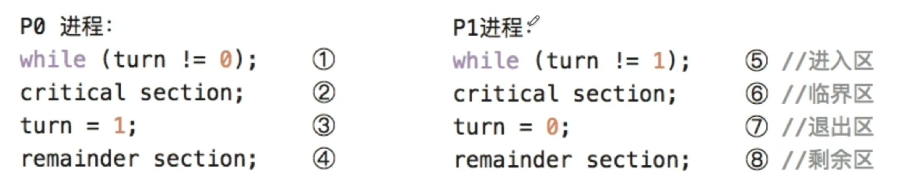
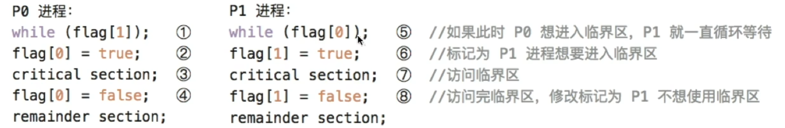
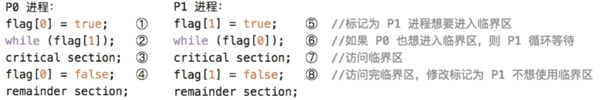
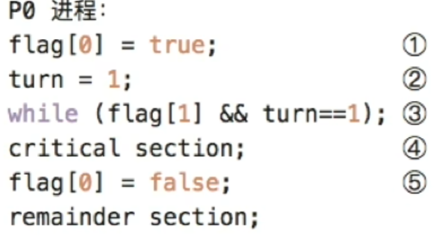
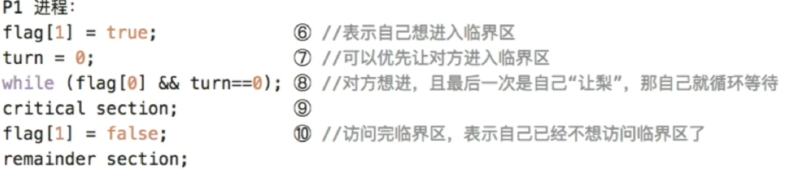
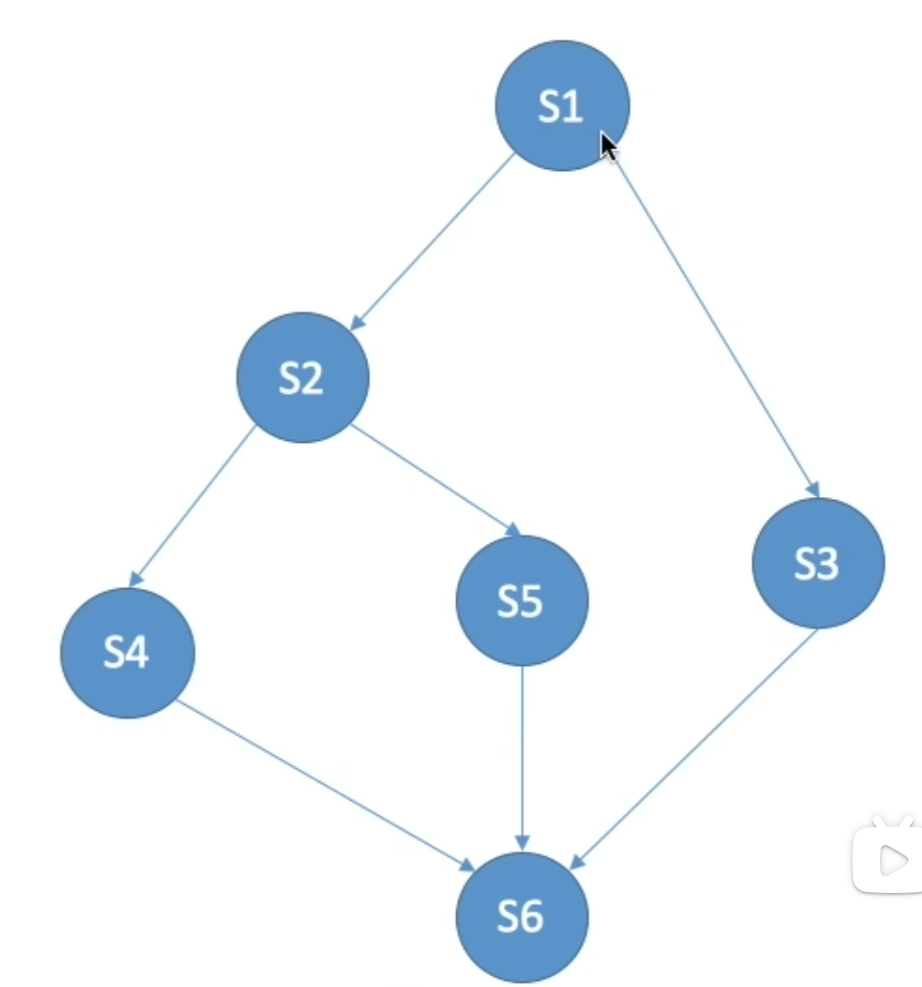

# 同步与互斥

## 同步和互斥的基本概念
在多道程序环境下，进程并发执行，不同进程存在多种相互制约关系。为了协调，引入了**进程同步**的概念

### 临界资源
许多资源在<u>同一时刻仅允许一个进程访问</u>，这类资源被称为**临界资源**。

临界资源必须**互斥访问**，每个进程访问临界资源的代码称为**临界代码**，划分为四个部分
-   **进入区**，进入临界区前，进程需要检查当前是否允许进入。若允许，则设置“正在访问临界区”标志，以阻止其他进程同时进入。
-   **临界区**，进程中世纪访问临界资源的代码，也叫<u>临界段</u>
-   **退出区**，离开临界区时，清楚访问标识。
-   **剩余区**，除上述三部分之外内容

```cpp
while(true)
{
    entry section;      //进入区
    critical section;   //临界区
    exit section;       //退出区
    remainder section;  //剩余区
}
```

### 同步（直接制约关系）
同步是指位完成某种任务而建立的两个或或多个进程，由于需要协调彼此的运行次序，而在执行过程中产生等待或穿戴信息的制约关系。

同步关系原语进程间的相互合作。

### 互斥（间接制约关系）
互斥指当一个进程正在临界区中使用临界资源时，其他试图访问该资源的进程必须等待。

### 同步机制应遵循以下准则
为防止多个进程同时进入临界区，应遵循：
-   **空闲让进**，临界区空闲，应运行一个请求进入的进程立即进入
-   **忙则等待**，已有进程在临界区，则其他请求进程必须等待，以保证<u>对临界资源的互斥访问</u>
-   **有限等待**，对任何请求进程，应保证期在有限时间进入临界区
-   **让权等待**，当进程因无法进入临界区而需要等待是，应该主动放弃CPU使用权，进入阻塞态
    > 原则上应该遵循，但非必须

    对于这一节所有无法实现让权等待的算法，若是前三无法实现忽略。我都有个问题，为什么都不引入阻塞。查找发现，对于多核，在等待途中很可能得到临界区资源，开销可能比上下文切换要小。而单核就很需要引入阻塞的。
    或者也可能是阻塞的出现较晚，只是学习的较早。
    > 查找发现的确如此

## 实现临界区互斥的基本方法
### 软件实现方法
在进入区设置并检查一些标志，用以表面师范有进程正在临界区中。若已有进程在临界区，则期进程在进入去通过循环检查方式等待；进程离开临界区后，在退出去修改相应标志

#### 单标志法
设置一个公用变量`turn`，用于指示当前允许进入临界区的进程编号。

每当一个进程退出临界区，就将`turn`设置为另一个进程


**缺点**
两个进程**必须**交替进入临界区，若某一个不再请求进入，则另一个再也无法进入，<u>违背空闲让进准则</u>

#### 双标志先检查法
设置一个bool类型数组`flag[2]`，用来标记各进程是否希望进入临界区。

一个进程进入临界区前，先检查对方是否想进入；若对方想，则等待；否则将自己的`flag[i]`置1，然后进入临界区。当其推出时，将`flag`置0


**优点** 无需交替使用，进程可以连续使用临界区
**缺点** 某些顺序，如1234，进程可能都先检查对方标识，再设置自己标识，然后都进入临界区。<u>违背忙则等待准则</u>

#### 双标志位后检查法
先设置自己标志，再检查对方标志


若顺序为1234，两个进程都先设置了格子标志，然后检查对方，发现对方想要进入，然后彼此等待。<u>违背空闲让进准则</u>。且进程可能长期等待，<u>违背有限等待准则</u>，可能导致饥饿

#### Peterson算法
结合13思想，`flag[]`解决互斥问题，`turn`解决饥饿问题

若`flag[i] = true`，则表示 $P_i$ 想要进入临界区
若 $turn = i$，则表示<u>如果两者**都想**进入，则让 $P_i$ 进入</u>

**具体操作**
在 $i$ 进入临界区前，先将自己的`flag[i]`设为1，并将`trun`设为 $j$（主动谦让）。随后检查`flag[j] && turn == j`，即对方想进入且运行其优先，若为真则等待，否则 $i$ 进入临界区

|
-|-


<u>仅没有遵循让权等待准则</u>

### 硬件实现方法
现代计算机提供了特殊硬件指令，能以原子方式对一个字进行检测和修改，或是交换两个字的内容。因此，可以利用他们实现临界区的互斥访问。

#### 中断屏蔽方法
**关中断**是实现互斥最简单的方法之一。

在执行临界区代码之前关闭中断，完成后重新打开即可。

**缺点**
-   限制CPU并非能力
-   将关中断权限开放给用户，风险很高
-   **不适用于多处理器系统**，在某一CPU关中断无法阻止其他CPU并发访问同一临界区


#### 硬件指令方法 —— TestAndSet指令
TS指令，也叫TestAndSetLock - TSL指令。

该指令是原子操作，功能是：读取知道标志的当前值，并立即将其置为 $1$，然后返回读取到的旧值。
```cpp
bool TestAndSet(bool *lock)// 只是类伪代码
{
    bool old;
    old = *lock;
    *lock = true;
    return old;
}
```

若返回值为 `false`，则当前未占用，可以进入临界区；否则等待。
因为TS指令会自动上锁，所以进程只需要结束时解锁。

#### 硬件指令方法 —— Swap指令
Swap指令**原子的**交换两个变量的值
典型实现如下
```cpp
bool key = true;
while(key != false)
    swap(&lock, &key);
// 临界区代码
lock = false;
// 其他代码
```

## 互斥锁
解决临界区最简单的工具是互斥锁。一个进程在进入临界区前调用`acquire()`获得锁；退出时调用`release()`释放锁。

每个互斥锁包含一个`available`变量，用于表示锁是否可用。

```cpp
acquire()// 获得锁的定义
{
    while(!acailable);// 忙等待
    available = false;// 获得锁
}
release()// 释放锁的定义
{
    available = true;// 释放锁
}
```

`acquire()`和`release()`必须是原子操作，所以互斥锁通常采用硬件机制实现。

上述锁也称为**自旋锁**，缺点是<u>忙等待</u>，类似的还有单标志法，TS指令，Swap指令。适用于多处理器系统。

## 信号量
信号量机制是一种功能强大的同步机制，能解决互斥问题和进程间同步问题。

它今年通过两个**标准原语**访问：`wait()`和`signal()`，也叫 $P$ 操作 和 $V$ 操作。

### 整型信号量
用一个<u>整型变量 $S$</u> 表示某类资源的可用数量。

仅限三种操作对其使用：初始化、P操作，V操作
```cpp
P(S)// wait()
{
    while(S <= 0);// 循环等待
    S --;
}

V(S)// signal()
{
    S ++;
}
```

当 $S \le 0$ 时，会忙等待。<u>未遵循让权等待</u>

### 记录型信号量
通过阻塞机制**实现了让权等待**

记录型信号量采用结构化数据表示
```cpp
struct
{
    int value;;         // 当前可用资源数
    struct process *L;  // 等待队列，用于链接阻塞进程
}semaphore;
```

响应的PV操作
```cpp
void P(semaphore S)
{
    S.value --;
    if(S.value < 0)
    {
        add this process to S.L;// 将当前进程加入等待队列
        block(S.L);             // 自我阻塞
    }
}

void V(semaphore S)
{
    S.value ++;
    if(S .value <= 0)
    {
        remove a process P form S.L // 从等待队列S.L取出一个进程P
        wakeup(P);                  // 唤醒
    }
}
```
`block()`和`wakeup()`出自第一节阻塞和唤醒原语

### 利用信号量实现互斥
为使多个进程互斥访问临界资源，为该资源设置一个**互斥信号量S**，初始设为 $1$。
> 为什么不设置为可用数量？
    因为需要的是互斥的访问临界区，也就是同时只允许一个进程访问。

具体如代码
```cpp
semaphore S = 1;
P1()
{
    // ...
    P(S);   // 申请临界资源，加锁
    临界区
    V(S);   // 释放临界资源，解锁
    // ...
}

P2()
{
    // ...
    P(S);
    临界区
    V(S);
    // ...
}
```

### 利用信号量实现互斥
若某一进程的操作依赖另一进程的执行结果，则必须保证前者在后者之后执行。

为此，引入一个**同步信号量 $S$**，初值设为 $0$
```cpp
semaphore S = 0;    // 初始化信号量
P1()
{
    // ...
    x;              // 执行语句x
    V(S);           // 通知P2，x已完成
    // ...
}

P2()
{
    // ...
    P(S);           // 等待x完成
    y;              // 使用x的结果执行y
    // ...
}
```

在 $P_1$ 执行后，$P_2$ 才能通过P操作，顺利执行y；若是先执行 $P_2$，P操作会调用`block()`阻塞 $P_2$


### PV操作实现同步互斥的总结
**同步**，提供资源的行为之后，应该V该资源；需要改资源的操作之前，应该P该资源
**互斥**，临界区应该被降紧夹在PV操作中

### 利用信号量实现前驱关系
每对前驱关系都对应一个同步问题，后继段必须等待前驱段完成。
**示例**


```cpp
semaphore a12 = 0, a13 = 0, a24 = 0, a25 = 0, a36 = 0, a46 = 0, a56 = 0;
S1()
{
    // ...
    V(a12), V(a13);
}
S2()
{
    P(a12);
    // ...
    V(a24), V(a25);
}
S3()
{
    P(a13);
    // ...
    V(a36);
}
S4()
{
    P(a24);
    // ...
    V(a46);
}
S5()
{
    P(a25);
    // ...
    V(a56);
}
S6()
{
    P(a36);
    P(a46);
    P(a56);
    // ...
}
```

## 经典同步问题
### 生产者 - 消费者问题
```cpp
semaphore mutex = 1;
semaphore empty = 1;
semaphore full = 1;
producer()
{
    while(1)
    {
        // 生产产品
        P(empty);
        P(mutex);
        // 放入缓冲区
        V(mutex);
        V(full);
    }
}
consumer()
{
    while(1)
    {
        P(full);
        P(mutex);
        // 取出产品
        V(mutex);
        V(empty);
        // 消费产品
    }
}
```
**必须先判断是否能操作，在锁住**


### 多生产者 - 消费者问题
问题描述
桌上有一个盘子，最多容纳一个水果。
-   爸爸向盘中放入苹果
-   妈妈向盘中放入橘子
-   女儿只吃苹果
-   儿子只吃橘子

当盘子空，爸爸妈妈才能放入一个水果；盘子有自己需要的，儿子女儿才能取出使用

**因为盘子只有一个位置**，所以自带互斥的性质（至多只能有一个进程访问盘子）。若是盘子容量 $>1$，则进程应该互斥。否则可能互相覆盖。
> 王道说是互相覆盖，但感觉更可能是总量超出容量，不过也得看实际情况

```cpp
// 盘子容量为1情况
semphore plate = 1, apple = 1, orange = 0;
dad()
{
    while(1)
    {
        准备一个苹果;
        P(plate);
        苹果放入盘子;
        V(apple);
    }
}
mom()
{
    while(1)
    {
        准备一个橘子;
        P(orange);
        橘子放入盘子;
        V(orange);
    }
}
son()
{
    while(1)
    {
        P(orange);
        从盘子中取出橘子;
        V(plate);
        吃掉橘子;
    }
}
daughter()
{
    while(1)
    {
        P(apple);
        从盘子中取出苹果;
        V(plate);
        吃掉苹果;
    }
}

// 盘子容量为2
semphore plate = 1, apple = 1, orange = 0;
semphore mutex = 1;
dad()
{
    while(1)
    {
        准备一个苹果;
        P(plate);
        P(mutex);
        苹果放入盘子;
        V(mutex);
        V(apple);
    }
}
mom()
{
    while(1)
    {
        准备一个橘子;
        P(orange);
        P(mutex);
        橘子放入盘子;
        V(mutex);
        V(orange);
    }
}
son()
{
    while(1)
    {
        P(orange);
        P(mutex);
        从盘子中取出橘子;
        V(mutex);
        V(plate);
        吃掉橘子;
    }
}
daughter()
{
    while(1)
    {
        P(apple);
        P(mutex);
        从盘子中取出苹果;
        V(mutex);
        V(plate);
        吃掉苹果;
    }
}
```

### 读者-写者问题
读者写者共享一个文件，多个读者可以同时读取文件，但是任一写者和其他进程互斥。

**读者优先**
若是读者源源不断，可能写者饥饿
```cpp
int count = 0;      // 记录读者数量
seamphore mutex = 1, rw = 1;

writer()
{
    while(1)
    {
        P(rw);
        wirte;
        V(rw);
    }
}

reader()
{
    while(1)
    {
        P(mutex);   // 互斥访问count
        if(count == 0)
            P(rw);  // 上锁写者
        count ++;
        V(mutex);
        read;
        P(mutex);   // 互斥访问count
        count --;
        if(count == 0)
            V(rw);
        V(mutex);
    }
}
```

**写者优先**
```cpp
int count = 0;      // 记录读者数量
seamphore mutex = 1, rw = 1;
seamphore w = 1;
writer()
{
    while(1)
    {
        P(w);   // 上锁读者
        P(rw);
        wirte;
        V(rw);
        V(w);   // 解锁
    }
}

reader()
{
    while(1)
    {
        P(w);
        P(mutex);   // 互斥访问count
        if(count == 0)
            P(rw);  // 上锁写者
        count ++;
        V(mutex);
        read;
        P(mutex);   // 互斥访问count
        count --;
        if(count == 0)
            V(rw);
        V(mutex);
    }
}
```

### 哲学家进餐问题
$n$ 位哲学家在一个圆桌，两人直接有一双筷子，每个人只有拿着两边的筷子才能吃饭。

## 管程
类似于类的概念，但是貌似重点在基础概念而非伪代码

管程利用一个**共享数据结构**来表示系统中的的共享资源，并将对该数据结构的所有操作封装为一组过程（类似函数）。进程对共享资源的申请、释放等操作，都必须通过调用这些过程完成。