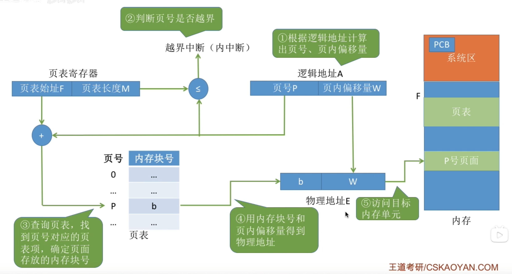
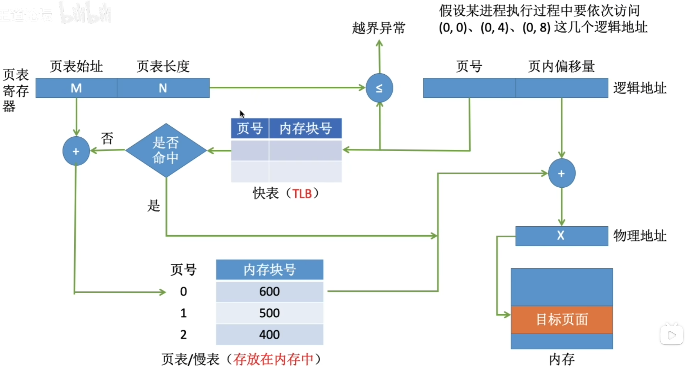
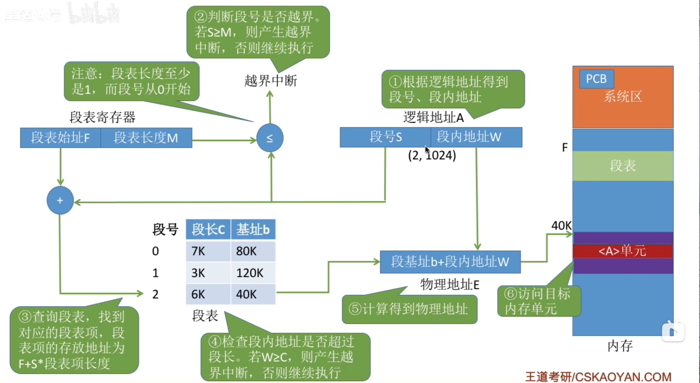

# 内存管理概念
## 内存管理的基本原理和要求
<u>内存管理是OS最核心也最复杂的机制之一</u>

**内存管理**是指OS对内存空间的**组织、分配、回收**以及**地址映射**等一系列操作。

内存管理的**主要功能包括**
-   **内存空间的分配与回收**
-   **地址转换**，将逻辑地址动态转换为对应的物理地址
-   **内存空间的扩充**，通过虚拟存储技术
-   **内存共享**
-   **存储保护**

### 程序的链接与装入
进程创建时，需要将程序和数据装入内存。将用户源程序转换为可在内存中执行的程序，通常需要：
-   编译
-   链接
-   装入（加载）

### 逻辑地址和物理地址
编译后的每个目标模块通常从 $0$ 好单元开始变质，被称为<u>相对地址</u>；链接程序整合模块时，会将各个模块的的相对制作拼为一个 $0$ 开始变质的**逻辑地址空间**（或虚拟地址空间）

用户程序只需要关注逻辑地址，而底层的内存管理机制透明。

**物理地址空间**是指主存中所有物理存储单元的集合，是地址转换的最终目标。
-   早期系统程序装入内存时需要将<u>逻辑地址</u>转化为<u>物理地址</u>，这一过程称为<u>地址冲地位</u>
-   现代支持<u>虚拟内存</u>的系统中，该转换由**内存管理单元MMU**在硬件层面运行时自动完成

现代OS为每个进程维护一张**页表**，用于**记录逻辑页到物理页框的映射关系**

### 程序的链接
链接程序的作用是将编译生成的目标模块及其所需库函数合并，形成一个完整的装入模块。

根据链接时机，分为三种方式
-   **静态链接**
    在程序运行**之前**，将个目标模块及其所需的库函数链接成一个完整的装入模块，从此不在拆分。需要完成两件关键操作：
    -   <u>地质条件</u>，根据其在装入模块的实际位置，将内部地址加上统一偏移量
    -   <u>外部符号解析</u>，将模块间引用的外部符号替换为确定的地址
-   **装入时动态链接**
    将用户源程序编译后生成的一组目标模块，在装入内存时采用边装入边链接的方式，具体：当装入时遇到对外部模块的调用，则立即查找并装入相应的模块。优点如下：
    -   <u>便于修改和更新</u>，各模块独立存放，只需要替换被修改的模块，无需重建整个程序
    -   <u>便于实现对目标模块的共享</u>，可将同一个目标模块链接到多个应用程序中
-   **运行时动态链接**
    是装入时动态链接的改进，仅当需要调用某个尚未装入内存的目标模块时，OS才动态加载并链接该模块

### 程序的装入
**绝对装入**
仅适用于<u>单道程序环境</u>，此时程序中的逻辑地址与实际物理地址完全一致

**可重定位装入**
适用于<u>多道程序环境</u>

装入时虚脱根据内存当前空闲情况，为该模块分配一块**连续的内存空间**，并将整个模块装入其中。随后<u>一次性将所有</u>逻辑地址修改为对应的物理地址，此过程称为<u>重定位</u>，因为运行时不再改变，所以叫<u>静态重定位</u>

进程<u>必须</u>**在装入前**获得全部所需内存空间；一旦装入，进程在运行期间不能移动或动态申请额外内存，**限制了内存管理的灵活性**

**动态运行时装入**
装入程序将装入模块载入内存，并不立即转换地址，而是将地址转换<u>推迟到</u>地址实际执行时再运行。

系统借助一个<u>重定位寄存器</u>，存放该模块在内存中的起始物理地址。程序中保留逻辑地址，而<u>实际物理地址</u>由硬件在运行时动态得出

**优点**：
-   支持程序在内存中的移动，便于OS进行紧凑
-   提高内存分配灵活性

### 内存保护
为确保各进程拥有独立的内存空间，内存保护机制需要再内存分配前防止用户进程破坏OS，同时避免进程间干扰。常用以下两种方法
-   在CPU设置一堆上下限寄存器，存储进程在内存的上下限地址，每次CPU访问时判断是否越界
-   采用<u>重定位寄存器（基地址寄存器）</u>和<u>界地址寄存器（限长寄存器）</u>存储起始地址和地址空间长度，实现越界检查
    界地址寄存器判断长度是否符合，再加上重定位寄存器的值得到物理地址

### 内存共享
只有**只读**区域才可以被共享。<u>可重入代码</u>是一种运行多个进程同时访问但不允许任何进程修改的代码。

在执行时，每个进程配备独立的**私有数据区**；进程仅对私有数据区进行写操作，而共享代码段始终保持不变。

### 内存分配与回收
单一连续分配 $\to$ 固定分区分配 $\to$ 动态分区分配 $\to$ 离散分配

## 连续分配管理方式
**连续分配方式**指位一个用户程序分配一个连续的内存空间。

### 单一连续分配
内存被划分为<u>系统区</u>和<u>用户区</u>。

<u>系统区</u>仅供OS使用，通常位于低地址
<u>用户区</u>仅允许**一道**用户程序运行

**优点**：结构简单，无**外部**碎片，无需内存保护机制
**缺点**：仅适用于单用户单认为的OS，<u>存在**内部**碎片</u>，**内存利用率极低**

### 固定分区分配
是最简单的一种多道程序存储管理方式

将用户空间划分为若干**大小固定**的分区，每个分区仅能容纳一道作业

在划分分区时，有两种方法：
-   分区大小相等，缺乏灵活性，但是很适用于一台计算机控制多个相同对象
-   分区大小不等，划分多个小分区，适量中分区和少量大分区，适应性提高

为便于内存的分配与回收，系统维护一张<u>分区使用表</u>，表项包含对应分区的始值，大小及状态

该方法存在两个问题：
-   若作业大于所有分区，则无法装入
-   若作业小于分区，则造成<u>内部碎片</u>，且<u>无法支持多个进程共享同一片内存区域</u>

### 动态分区分配
#### 基本原理
<u>动态分区分配</u>也称<u>可变分区分配</u>，指在进程装入内存时，按其实际需求动态分配一看大小恰好匹配的连续内存空间；系统中分区的数量和大小随进程的装入与是否而动态变化

**需要解决的问题**
随着进程频繁装入与释放，内存中会鸡肋大量分散小空闲块，导致内存余量充足但难以满足大津城需求，这些小空闲块被称为**外部碎片**

**外部碎片**可以通过**紧凑技术**缓解：OS周期性地一点进程，将空闲块合并为一个连续区域；该操作要求系统支撑动态重定位，且开销较大

**维护方式**
系统维护一张空闲分区链（表），<u>通常</u>按起始地址排序。
-   分配时寻找一个满足大小的空闲分区，分割（若足量）所需空间，剩余部分（若存在）保存在链中
-   回收内存时根据分区起始地址缺点插入位置，并执行**合并操作**
    -   若前空闲，则更新前一分区大小
    -   若后空闲，则更新后移分区起始地址与大小
    -   若前后无空闲，插入到链中
    -   若前后均空闲，则三者合并，更新前分区大小

#### 基于顺序搜索的分配算法
顺序分配算法通过一次遍历空闲分区链，查找第一个满足作业大小要求的分区。
-   **首次适应(First Fit)算法**，空闲分区按地址一次递增次序排列。分配时从**链首**开始顺序查找
    -   **优点**：优先利用低地址分区，从而保留高地址打空闲区，利用大作业装入
    -   **缺点**：低地址容易极冷小碎片，且每次分配从链首开始，查找开销增大
-   **邻近使用(Next Fit)算法**，也称循环适应算法，与首次适应不同在于：分配时从**上次查找结束的位置**开始循环搜索。
    -   **优点**：有效减少了对低地址区域的重复扫描
    -   **缺点**：导致打空闲区在内存中分配不均，难以有效支撑后续大作业装入，整体性能通常不如前者
-   **最佳适应(Best Fit)算法**，空闲区按**容量递增次序排列**
    -   **优点**：能尽量保留较大的空闲分区
    -   **缺点**：每次分配都在原分区留下极小剩余快，**产生大量外部碎片**，实际性能通常较差
-   **最欢使用(Worst Fit)算法**，空闲分区按**容量递减次序排列**
    -   **优点**：避免生成小碎片来提升内存利用率
    -   **缺点**：总是切割最大空闲区，系统很难满足大作业需求，性能同样不佳

**First Fit算法在实现开销，碎片控制与大作业支持之间取得来来来较好的平衡**

#### 基于索引的分配算法
在空闲分区链很长时，顺序搜索算法效率较低，所以引入**索引分配算法**：
根据空闲分区的大小进行分配，对每一类大小相同的空闲分区建立独立的空闲分区链，并通过一张**索引表**统一管理

-   **快速适应(Quick Fit)算法**，根据系统中进程常用的空间大小，预先将空闲分区划分为若干固定尺寸的类别
    -   **优点**：查找效率高，不产生内存碎片
    -   **缺点**：回收时难以有效合并分区，算法复杂，开销较大
-   **伙伴系统(Buddy System)**，规定所以分区大小为 $2^k$，分配大小为 $n$ 的内存时，查找 $2^i \ge n$ 的块，若不存在则查找 $2^{i+1}, 2^{i+2}, \cdots$，直到找到一个可用分区，然后将该分区**不断二分**，直到进程所在分区再分割则无法存放。回收时，内存尝试与相邻伙伴内存（即分割前在同一块的内存分区）合并。
    > 事实上就是归并，或者按线段树的分割理解，每次只能合并处于同一节点的左右儿子。然后初始内存只有一个最大的分区
-   **哈希算法**，以空闲分区大小为关键字，建立哈希函数，构建哈希表

**非连续分配**
连续分配方式很难真正解决<u>外部碎片</u>，所以引入了**非连续分配方式**：将进程的地址空间划分为多个单元，并允许这些单元分散地装入内存中互不相邻的区域

## 基本分页存储管理
固定分区产生内部碎片，动态分区产生外部碎片，两种方式对内存利用率都较低，所以引入了**分页存储管理**以解决

**分页存储管理**
将物理内存划分为若干大小相等的固定单元，称为页框（页帧，内存块，物理块，物理页面；同时将进程的<u>逻辑地址</u>划分为**与页框大小相同**的单元，称为页面（页）

<u>每个进程平均产生的页内碎片约为半页</u>

### 基本概念
#### 页面和页面大小
**页号**：进程的逻辑地址空间被划分为**若干页面**，每个页面有一个编号，从 $0$ 开始。
**页框号**（页框等效名称 $+$ 号）：物理内存中点名写个页框也有一个编号，同样从 $0$ 开始。

**页面大小通常为 $2^k$**
-   页面过小，则页面数量多，页表过程，占用大量内存且增加地址转化开销
-   页面过大，导致页内碎片过多

#### 地址结构
**逻辑地址**：页号 $P$ 和页内偏移量 $W$
*以 $32$ 位地址为例，若页面大小为 $2^{12}B(4KB)$*
$31 \cdots 12$|$11 \quad \cdots \quad 0$
-|-
页号 $P$|页内偏移量 $W$

#### 页表
系统为**每个进程**建立一张**页表**，以实现逻辑地址到物理地址的转换。
**页表**是一个按页号顺序排列的数组，每个**页表项**记录对应页面所驻留的**页框号**，以及相关状态信息。

<u>**页表**的作用是实现从**页号到页框号的映射**</u>

### 基本地址变换机构

**地址变换机构**借助**页表**将<u>逻辑地址</u>转化为<u>物理地址</u>

为提高地址变换速度，系统设置一个**页表寄存器PTR**，存放页表在内存的<u>始址 $F$</u>和<u>页表长度 $M$</u>。因为寄存器昂贵，单CPU系统只设置一个PTR

**地址转换过程**
-   根据逻辑地址计算**页号 $P = \lfloor A/L \rfloor$、页内偏移量 $W = A\% L$**
-   判断页号是否越界，若页号 $P \ge $ 页表长度 $M$，产生<u>越界中断</u>
-   根据页号 $P$ 查找页表，找出对应页表项的**物理块号**。
    **页表项地址 $=$ 页表始址 $F$ + 页号 $P \times$ 页表项长度**
-   计算物理地址 **$E = bL + W$**，并据此访存

上述地址变换过程由MMU硬件自动完成

**页表项大小如何确定？**
页表项需要能表示所有可能的页框号
> 以 $32$ 位地址空间，按字节变质，页面大小为 $4KB$ 为例，物理内存包含 $2^{32}B / 4KB = 2^{20}$ 个页框，需要 $\log_2{2^{20}} = 20$ 位表示页框号，所以页表项需要至少 $\lceil 20/8\rceil = 3B$，<u>但处于对其和扩展koala，实际会设为 $4B$</u>

**面临的两个主要挑战**
-   每次访存需要地址转换，若转换速度不足，严重拖慢系统性能
-   **页表本身占用内存空间大**

因此发展处了快表和多级页表

### 具有快表的地址变换机构
若页表全部存放在内存中，则每次访问内存至少需要<u>两次访存</u>：
-   范根页表获得物理块号
-   根据物理地址访问目标内容

线代地址变化机构增设了一个具有并行查找能力的*高速缓冲存储器*——**快表TLB**，用于缓存当前活跃的若干页表项，*主存中的完整页表常被称为<u>慢表*</u>
> TLB和Cache并不同，TLB仅有页表项副本，而Chache存储各种数据

**地址变换过程**
-   CPU给出逻辑地址，阴间自动提取页号，并与快表中所有页号**并行比较**
-   **若命中**，直接从快表中取出并得到物理地址，此时只需要一次访存
-   **若未命中**，则按普通方法访问。同时系统将该页表项加入快表；若快表已满，则按特定算法置换旧项。

在程序有良好局部性的前提下，快表命中率可达 $90\% + $

### 两级页表
分页管理需要将整个页表驻留内存，但是**页表可能非常庞大**，若是再要求连续分配，非常拉低效率

所以可以将**页表本身也视为可分页对象**
-   对页表采用离散分配
-   仅将当前活跃部分页表项调入内存

本质上就是为已离散化的页表再建立一层页表

## 基本分段存储管理
<u>**分段管理方式**从用户和程序员的实际需求出发</u>，旨在支持方便编程，信息保护和共享，动态增长以动态链接等高级功能

### 分段
分段系统将用户进程的**逻辑地址空间**划分为若干<u>大小不等</u>的段

每个段内部从 $0$ 开始，并分配一段连续的地址空间

由于地址空间被阻止为多个具有明确语义的段，整个进程的逻辑地址结构呈现出二维特性：由段号和段内偏移量共同确定一个地址

逻辑地址由段号 $S$ 和段内偏移量 $W$ 两部分组成

$31 \cdots 16$|$15 \quad \cdots \quad 0$
-|-
段号 $P$|段内偏移量 $W$

**段号和段内偏移量必须由用户显示提供**

### 段表
每个进程都拥有一张**段表**，用于实现逻辑段到物理内存区的映射。段表中每个段对应一个段表项，记录该段在内存中的<u>基址</u>和<u>段长</u>

**段表内容**
|段号|段长|本段在内存的始址|
|-|-|-|

### 地址变换机构

系统设置了一个段表寄存器，用于存放段表始址 $F$ 和段表长度 $M$，地址变换过程：
-   从逻辑地址 $A$ 中分离出段号 $S$ 和段内偏移量 $W$
-   判断段号是否越界：若段号 $\ge$ 段表长度，则产生段号越界中断
-   根据段号 $S$ 查找段表，$段表地址 = 段表始址 F + 段号 S \times 段表长度$；取出该段表项该段长度 $C$，若 $W \ge C$，则段内越界中断
-   取出该段基址 $b$，$物理地址 E = b + W$

### 分页与分段的对比
-   页是<u>内存管理的**物理单位**</u>，目的是提高内存利用率，对用户透明
    段是<u>用户程序的**逻辑单位**</u>，目的是满足编程、共享、保护等需求，由编辑器根据程序结果划分，对用户可见
-   页大小固定，段不固定
-   页地址空间一维，只需要提供单一线性地址
    段地址空间二维，引用地址需要同时指名段名或段号和段内偏移量

### 段的共享与保护
分页系统实现共享，共享进程的页表需要建立 $N$ 个页表项
而分段徐涛物理该段多大，都只需要**一个**段表项

为支持**段共享**，系统维护一张**共享段表**，每个共享段对于一个表象，记录其段号，段长，内存始址，存在为，外存始址以及<u>共享进程计数器`count`</u>

不能被修改的代码称为**可重入代码**，系统通常将此类代码置于**只读段**
同时为每个进程配备**私有的局部数据区**，专门用于存放执行过程中肯变化的数据

**分段系统的保护机制**
-   地址越界保护
-   存取控制保护

## 段页式存储管理
*分页能有效提高内存利用率，分段能翻译程序的逻辑结构，并利于段的共享和保护*，将两者有事结合便创建了**段页式存储管理方式**

在段页式系统，进程的地址空间先辈划分为若干**逻辑段**，每段<u>拥有唯一段号</u>；每个段被进一步划分为若干**大小固定的页**。内存空间管理按分页方式

**进程逻辑地址：**
|段号 $S$|页号 $P$|页内偏移量 $W$|
|-|-|-|

为实现地址变换，系统为每个进程建立了一张段表，每个段表还对应一张页表。
系统还设置了一个段表寄存器，存放当前进程段表的始址和段表长度

**地址变换过程**
-   根据逻辑地址中段号 $S$，根据段表寄存器定位段表，并查得改短对应页表始址
-   系统利用页号 $P$ 访问页表，取得物理块号
-   将物理块号与页内偏移量 $W$ 拼接，形成物理地址

<u>基于逻辑地址的内存访问需要**三次访存**，可以引入快表加速</u>

对用户而言，程序按段组织，页的划分由系统完成且完全透明

**段页式管理系统的地址空间是二维的**，与分段系统一直