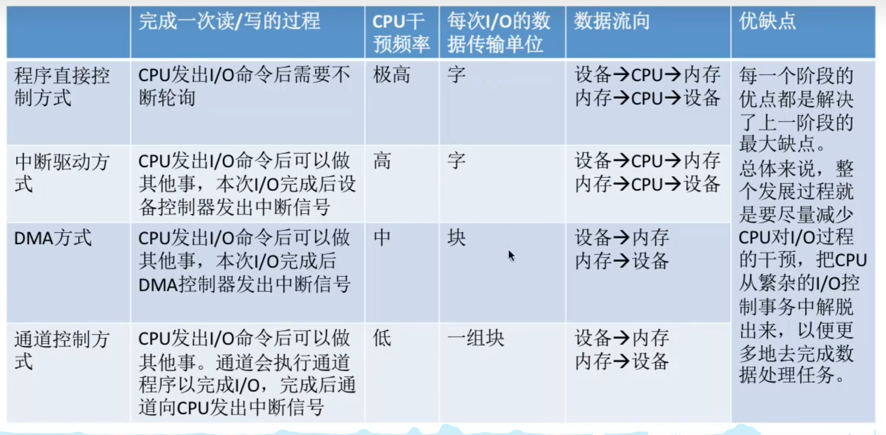
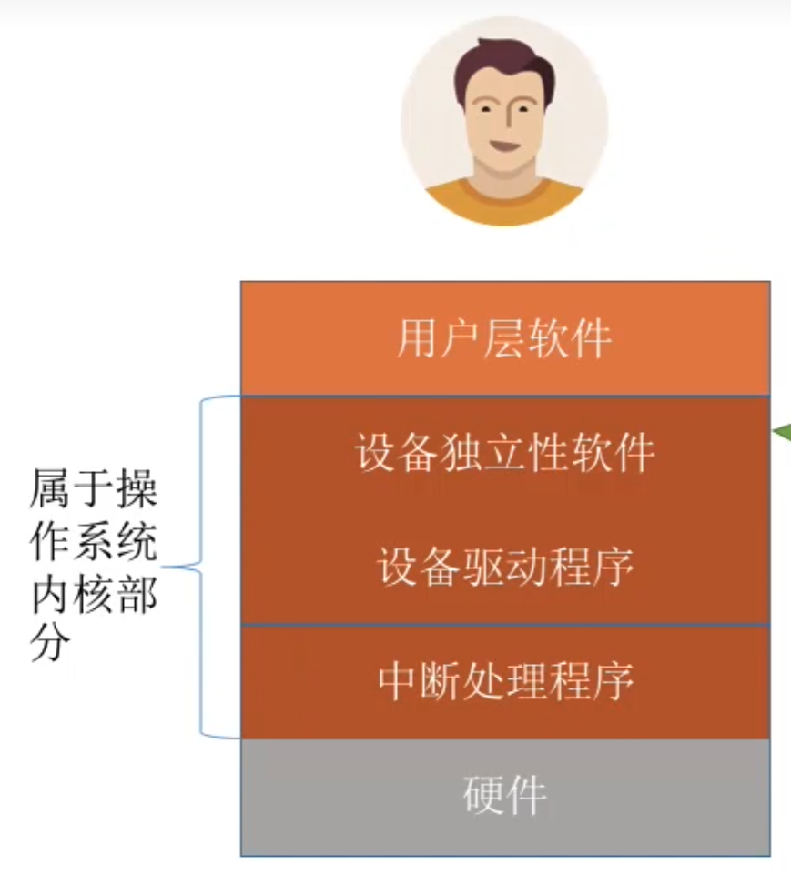

# IO管理概述
## IO设备
IO设备管理是OS最复杂且多样的部分，其核心是通过软硬件协作，屏蔽不同设备的物理差异，使应用程序能以统一方式使用各类设备。

一个IO设备由两部分组成
-   **设备本身**，是执行具体输入或输出的物理装置
-   **设备控制器**，是链接到系统总线上的专用电路，负责将OS发出的抽象命令转化为设备可识别的电信号，并协调主机与设备间的数据传输
    通过此设计，OS无需了解各类设备细节，便可统一管理它们
### 设备的分类
IO设备是指能够向计算机输入数据或接受其输出数据的外部设备。

**按信息交换单位分类**
-   <u>块设备</u>，以固定大小的数据块为单位进行信息交换
    传输速率较高，支持**随机访问**，允许对任意数据库进行读写操作
-   <u>字符设备</u>，以字符或字节为单位进行信息交换
    传输速率较低，**不可寻址**，通常采用中断方式实现异步通信

**按传输速率分类**
低俗设备，中速设备，高速设备

**按使用特性分类**
-   <u>人机交互设备</u>，用于用户与计算机之间的信息交互
-   <u>存储设备</u>，用于持久化存储数据
-   <u>网络通信设备</u>，用于计算机间通信

**按共享属性分类**
-   <u>独占设备</u>，任一时刻仅允许一个进程使用
-   <u>共享设备</u>，允许多个进程在逻辑上并发访问
-   <u>虚拟设备</u>，通过SPOOLing技术，将独占设备改造为多个逻辑设备

 
### IO接口
IO接口（设备控制器）是CPU与设备之间的桥梁，用于实现计算机与设备之间的数据交换。它接收CPU发出的命令，控制设备工作，其主要由三部分构成
-   **设备控制器与IO接口**，用于实现CPU与设备控制器之间的通信。
-   **设备控制器与设备接口**，一个设备控制器可以连接一个或多个设备，所以内部包含若干个设备接口。
-   **IO逻辑**，用于实现对设备的控制

**设备控制器**的主要功能有：
-   接收兵识别命令
-   完成数据交换
-   标识并报告设备状态
-   地址识别
-   数据缓冲
-   差错控制

### IO接口的类型
从不同角度看。可分为以下类型：
-   按数据传送方式，接口需要完成相应的串并或并串格式转换
    -   并行接口
    -   串行接口
-   按主机访问设备的控制方式
    -   程序查询接口
    -   中断接口
    -   DMA接口
-   按功能灵活性
    -   可编程接口
    -   不可编程接口
-   按设备的不同
    -   字符设备接口
    -   块设备接口
    -   网络设备接口

### IO端口
IO端口是指设备控制器中可悲CPU访问的寄存器
-   **数据寄存器**，缓存从设备送来的输入数据，或换从CPU发出的输出数据
-   **状态寄存器**，保存设备的状态或执行结构
-   **控制寄存器**，由CPU写入，用于启动操作或设置设备的工作模式

为使CPU能够访问IO端口，必须对各端口进行编址，每个端口对应一个唯一的端口地址。

常见编址方式如下
#### 独立编址（IO映射方式）
独立编址为IO设备建立了一个**独立于主存的地址空间**。

IO端口与内存地址在逻辑上完全分离，<u>地址值可以相同，但由于属于不同地址空间，不会发生冲突</u>，CPU通过专用的IO指令访问IO端口

**优点**：IO端口数量远少于内存单元，，地址线少，译码电路简单，寻址速度快；使用专用IO指令，程序中IO操作清晰

**缺点**：IO指令功能有限，通常仅支持简单的数据传输，程序设计灵活性差；CPU需要同时提供**存储器读写**和**IO读写**两组控制信号，增加了控制逻辑的复杂性

#### 统一编制（内存映射方式）
统一编址将**部分主存地址空间分配给IO端口**，使IO端口与内存单元共享同一地址空间。通过地址范围即可区分访问目标，因此无需专用IO指令，CPU使用普通的访存指令即可访问IO端口

**优点**：无需专用IO指令，使得变成更加灵活；IO短裤获得较大编制空间；IO访问保护机制可由虚拟存储管理系统统一实现

**缺点**：IO端口占用主存地址空间，**减少了系统可用内存容量**；需要根据完整地址判断是否IO区域，译码电路相对复杂，通常会降低译码速度

## IO控制方式
IO控制是指控制设备和主机之间的数据传送

**宗旨**：尽量减少CPU对IO控制的干预，以便其能更多地去执行运算任务

IO控制方式共有 $4$ 种

## IO控制方式

> 通道控制方式不考
### 程序直接控制方式
CPU对IO设备的控制采用轮询的IO方式，也称*程序轮询*方式

CPU想设备控制器放出了一条IO指令，从IO设备读取一个字，然后不断地**循环测试设备状态（轮询）**，直到确定该字已在设备控制器的数据寄存器中。于是CPU将数据寄存器中的数据取出，送入内存的制定单元

## IO软件层次结构

